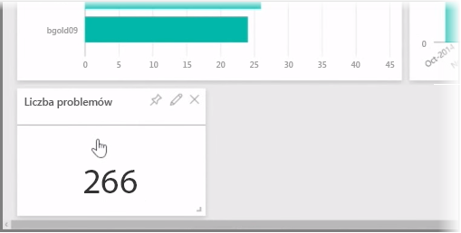

Jak się dowiedzieliśmy, typowy przepływ pracy w usłudze Power BI to utworzenie raportu w programie Power BI Desktop, opublikowanie go w usłudze Power BI, a następnie udostępnienie innym osobom do wyświetlania w usłudze lub aplikacji mobilnej.

Jednak niektórzy rozpoczynają pracę w usłudze Power BI, więc szybko rzućmy na nią okiem, aby dowiedzieć się, jak można łatwo, sprawnie i szybko utworzyć wizualizacje w *pakietach zawartości* usługi Power BI.

**Pakiet zawartości** to wstępnie skonfigurowana kolekcja gotowych wizualizacji i raportów opartych na danych z konkretnych źródeł danych, takich jak usługa Salesforce. Użycie pakietu zawartości to jak przygotowanie gotowego obiadu w mikrofalówce lub zamówienie jedzenia z dostawą: kilka kliknięć i komentarzy szybko daje dopasowaną kolekcję potraw — wszystko w postaci schludnego, gotowego do konsumpcji pakietu.

Spójrzmy zatem na pakiety zawartości, usługę i ich działanie. Temat pakietów zawartości (i usługi) zostanie przedstawiony bardziej szczegółowo w kolejnych sekcjach — pomyśl o tym jako o skosztowaniu w celu zaostrzenia apetytu.

## Tworzenie pulpitów nawigacyjnych gotowych do użycia za pomocą usług w chmurze
Dzięki usłudze Power BI łączenie z danymi jest łatwe. W usłudze Power BI możesz po prostu wybrać przycisk **Pobierz dane** w lewym dolnym rogu ekranu głównego.

Na *kanwie* (obszarze w centrum usługi Power BI) są wyświetlane źródła danych dostępne w usłudze Power BI. Oprócz typowych źródeł danych, takich jak pliki programu Excel, bazy danych lub dane platformy Azure, usługa Power BI może równie łatwo łączyć się z **usługami oprogramowania** (nazywanymi także dostawcami SaaS lub usługami w chmurze), takimi jak Salesforce, Facebook, Google Analytics i całą gamą innych usług SaaS.

W przypadku tych usług oprogramowania **usługa Power BI** udostępnia kolekcje gotowych do użycia wizualizacji wstępnie zestawionych w pulpity nawigacyjne i raporty nazywane **pakietami zawartości**. Pakiety zawartości zapewniają szybki start w usłudze Power BI z wykorzystaniem danych z wybranej przez Ciebie usługi. Jeśli na przykład użyjesz pakietu zawartości dla usługi Salesforce, usługa Power BI połączy się z Twoim kontem usługi Salesforce (po podaniu poświadczeń), a następnie wstępnie zdefiniuje kolekcję wizualizacji i pulpitów nawigacyjnych w usłudze Power BI.

Usługa Power BI udostępnia pakiety zawartości dla szerokiej gamy usług. Na poniższym obrazie przedstawiono pierwszy ekran usług, w kolejności alfabetycznej, który jest wyświetlany po wybraniu polecenia **Pobierz** w polu **Usługi** (pokazanego na poprzednim obrazie). Jak widać na poniższym obrazie, jest wiele możliwości do wyboru.

Dla naszych potrzeb wybraliśmy usługę **GitHub**. Usługa GitHub to aplikacja online do kontroli kodu źródłowego. Po wprowadzeniu informacji i poświadczeń dla pakietu zawartości usługi GitHub rozpocznie się importowanie danych.

Gdy dane zostaną załadowane, zostanie wyświetlony wstępnie zdefiniowany pulpit nawigacyjny pakietu zawartości usługi GitHub.

Oprócz **pulpitu nawigacyjnego** jest także dostępny **raport** wygenerowany (w ramach pakietu zawartości usługi GitHub) na potrzeby utworzenia pulpitu nawigacyjnego oraz **zestaw danych** (kolekcja danych pobranych z usługi GitHub) utworzony podczas importowania danych i użyty do utworzenia raportu usługi GitHub.

Na pulpicie nawigacyjnym możesz kliknąć dowolną wizualizację, co spowoduje automatyczne przejście do strony **raportu**, na podstawie której wygenerowano tę wizualizację. Kliknięcie wizualizacji **5 pierwszych użytkowników według żądań ściągnięcia** spowoduje otwarcie przez usługę Power BI strony **Żądania ściągnięcia** w raporcie (strony raportu, na podstawie którego utworzono tę wizualizację).

## Zadawanie pytań dotyczących danych
Ponadto możesz zadawać pytania dotyczące danych, a usługa Power BI utworzy wizualizacje oparte na Twoim pytaniu w czasie rzeczywistym. Na poniższym obrazie znajduje się usługa Power BI tworząca wizualizację liczbową licznika zamkniętych problemów na podstawie informacji wpisanych na pasku **Zapytanie w języku naturalnym**.

Gdy wizualizacja Ci odpowiada, możesz wybrać ikonę **Przypnij** z prawej strony paska zapytań w języku naturalnym, aby przypiąć ją do pulpitu nawigacyjnego. W tym przypadku wizualizacja zostanie przypięta do pulpitu nawigacyjnego usługi GitHub, ponieważ ten pulpit nawigacyjny jest aktualnie wybrany.

## Odświeżanie danych w usłudze Power BI
Zestaw danych pakietu zawartości lub inne dane używane w usłudze Power BI możesz także **odświeżyć**. Aby określić ustawienia odświeżania, wybierz wielokropek obok zestawu danych w celu wyświetlenia menu.

Wybierz opcję **Zaplanuj odświeżanie** w dolnej części menu. Na kanwie zostanie wyświetlone okno dialogowe Ustawienia, umożliwiając określenie wybranych ustawień odświeżania.

I to już cały rzut oka na usługę Power BI. Jest wiele innych rzeczy, które można zrobić za pomocą usługi. Ich omówienie zawiera dalsza część tego kursu. Pamiętaj także, że istnieje wiele różnych typów danych, z którymi można nawiązać połączenie, i szeroka gama pakietów zawartości, która cały czas się powiększa.

Przejdźmy do następnego tematu, który zawiera podsumowanie tej sekcji **Wprowadzenie**, i przygotujmy się na dalszy ciąg.

