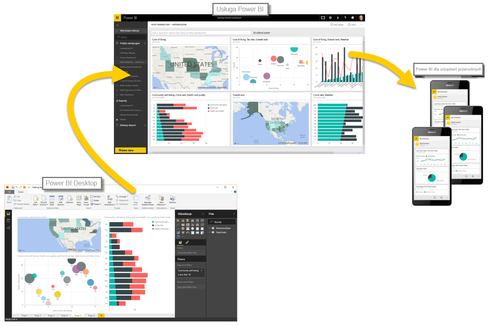

Przypomnijmy pokrótce informacje omówione w pierwszej sekcji.

Usługa **Power BI** to zbiór usług oprogramowania, aplikacji i łączników, które działają razem, aby przekształcić dane w interaktywne analizy. Możesz użyć danych z pojedynczego podstawowego źródła, takiego jak skoroszyt programu Excel, lub pobrać dane z wielu baz danych i źródeł w chmurze, aby utworzyć złożone zestawy danych i raporty. Usługa Power BI może być tak prosta, jak chcesz, lub tak złożona, jak wymagają tego rozbudowane globalne wymagania biznesowe przedsiębiorstwa.

Usługa Power BI składa się z trzech głównych elementów — programu **Power BI Desktop**, **usługi Power BI** i aplikacji **Power BI Mobile** — które współdziałają, aby umożliwić Ci tworzenie, udostępnianie i interaktywne korzystanie z danych na wybrane sposoby.

Omówiliśmy podstawowe bloki konstrukcyjne usługi Power BI:

* **Wizualizacje** — wizualne reprezentacje danych.
* **Zestawy danych** — kolekcje danych używane przez usługę Power BI do tworzenia wizualizacji.
* **Raporty** — kolekcje wizualizacji z zestawu danych obejmujące jedną lub więcej stron.
* **Pulpity nawigacyjne** — kolekcje wizualizacji mieszczące się na jednej stronie i utworzone na podstawie raportu.
* **Kafelki** — pojedyncze wizualizacje w raporcie lub na pulpicie nawigacyjnym.

W tym miejscu przyjrzeliśmy się usłudze Power BI za pomocą szkolenia wideo, które poprowadził **Will Thompson**. Will przedstawił nam krótki przegląd metody analizowania i wizualizowania danych przy użyciu usługi Power BI.

<!---
In **Power BI Desktop**, we connected to a basic Excel file, created visualizations, then published those visualizations to the service. Even if you use Power BI only with your Excel workbooks, you can gain amazing visual insights with those Excel workbooks, and both interact and share it in ways never before possible.
-->
W **usłudze Power BI** utworzyliśmy pulpit nawigacyjny za pomocą kilku kliknięć. Kontynuując nasze spotkanie z usługą Power BI, użyliśmy **pakietu zawartości** — gotowej do użycia kolekcji wizualizacji i raportów — oraz połączenia z **usługą oprogramowania** do wypełnienia pakietu zawartości i ożywienia danych.

Użyliśmy także zapytań w języku naturalnym, znanych jako **Pytania i odpowiedzi**, aby zadać pytania w celu uzyskania naszych odpowiedzi i umożliwić usłudze Power BI utworzenie wizualizacji opartych na tych pytaniach. Na koniec skonfigurowaliśmy **harmonogram odświeżania** dla danych, aby zapewnić, że gdy wrócimy do usługi Power BI, dane będą aktualne.

## Następne kroki
**Gratulacje!** Pierwsza część kursu **Nauka z przewodnikiem** dotyczącego usługi Power BI została ukończona. Teraz masz dobre podstawy do tego, aby przejść do następnej sekcji, **Pobieranie danych**, która jest kolejnym krokiem logicznego przepływu pracy w usłudze Power BI.

Wspomnieliśmy o tym wcześniej, lecz warto to przypomnieć: ten kurs buduje Twoją wiedzę, stosując kolejność określoną przez typowy przepływ pracy w usłudze Power BI:

* Umieszczenie danych w programie **Power BI Desktop** i utworzenie raportu.
* **Opublikowanie** danych w usłudze Power BI,w której można tworzyć nowe wizualizacje i pulpity nawigacyjne.
* **Udostępnienie** pulpitów nawigacyjnych innym użytkownikom — szczególnie tym, którzy pracują mobilnie.
* Wyświetlenie udostępnionych pulpitów nawigacyjnych i raportów oraz korzystanie z nich w aplikacjach **Power BI Mobile**.

Być może nie wykonujesz całej tej pracy — niektórzy tylko wyświetlają w usłudze pulpity nawigacyjne, które zostały utworzone przez kogoś innego. To w porządku, lecz ponieważ *przejdziesz* przez wszystkie sekcje tego kursu, to *zrozumiesz*, jak utworzono te pulpity nawigacyjne i połączono je z danymi, a potem może nawet zdecydujesz się na utworzenie takiego pulpitu samodzielnie.

Do zobaczenia w następnej sekcji!

