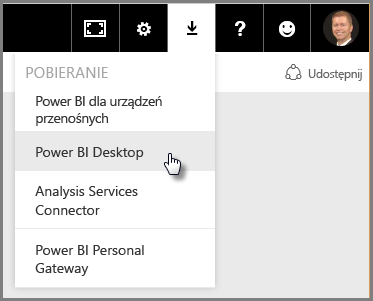
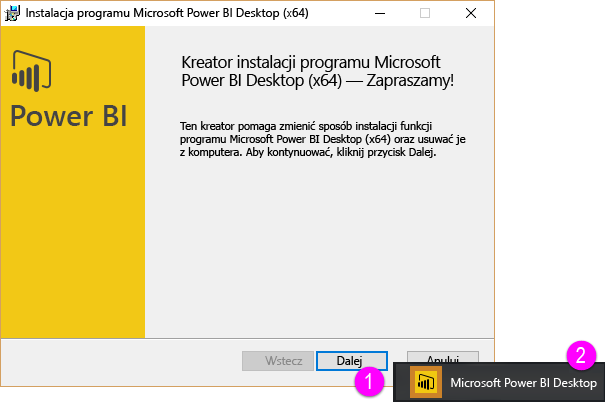
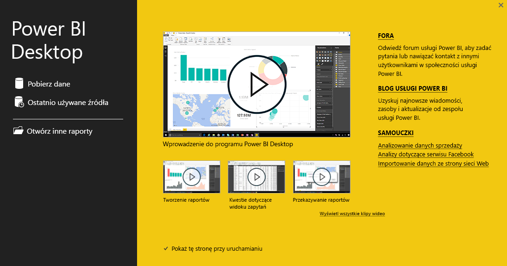

Witamy w drugiej sekcji kursu **Nauka z przewodnikiem** dla usługi Power BI pod tytułem **Pobieranie danych**. Ta sekcja obejmuje omówienie wielu funkcji i narzędzi usługi Power BI obsługujących dane, koncentrując się na programie Power BI Desktop. Wiele z tych narzędzi ma zastosowanie także do usługi Power BI, więc zapoznając się z tą sekcją, uczysz się podwójnie.

Gdy pobierasz dane, czasem nie są one tak dobrze sformatowane, czyli *wyczyszczone*, jak można by sobie tego życzyć. W tej sekcji dowiesz się, jak pobrać dane i oczyścić je (co jest nazywane *czyszczeniem* lub *transformowaniem* danych), oraz poznasz kilka zaawansowanych sztuczek, które mogą ułatwić pracę z pobieraniem danych.

Jak zawsze w tym kursie, nauka podąża tą samą drogą co przepływ pracy w usłudze Power BI. Dlatego zajrzyjmy do programu **Power BI Desktop**, od którego często się zaczyna.

## Przegląd programu Power BI Desktop
Program Power BI Desktop to narzędzie umożliwiające łączenie się z danymi, ich czyszczenie i wizualizowanie. Za pomocą programu Power BI Desktop możesz połączyć się z danymi, a następnie modelować je i wizualizować na różne sposoby. Najczęściej użytkownicy pracujący w projektach z zakresu analizy biznesowej spędzają większość czasu na pracy w programie Power BI Desktop.

Program Power BI Desktop możesz pobrać [z Internetu](http://go.microsoft.com/fwlink/?LinkID=521662) lub z usługi Power BI. Po prostu wybierz przycisk strzałki w dół w prawym górnym rogu usługi Power BI, a następnie wybierz program Power BI Desktop.

Program Power BI Desktop instaluje się jako aplikację na komputerze z systemem Windows.

Po pobraniu programu Power BI Desktop zainstaluj go i uruchom tak, jak inne aplikacje w systemie Windows. Na poniższym obrazie przedstawiono ekran startowy programu Power BI Desktop, który jest wyświetlany podczas uruchamiania aplikacji.

Program Power BI Desktop łączy się z różnymi źródłami danych — od lokalnych baz danych przez arkusze kalkulacyjne programu Excel aż do usług w chmurze. Ułatwia on czyszczenie i formatowanie danych w taki sposób, aby były bardziej użyteczne, w tym dzielenie kolumn i zmianę ich nazwy, zmienianie typów danych i pracę z datami. Możesz także utworzyć relacje między kolumnami, aby modelowanie i analizowanie danych było łatwiejsze.

