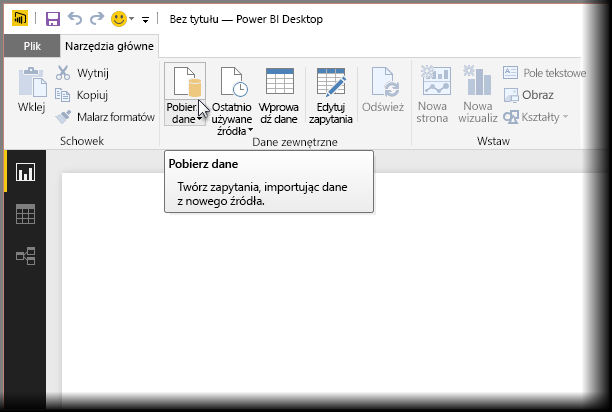
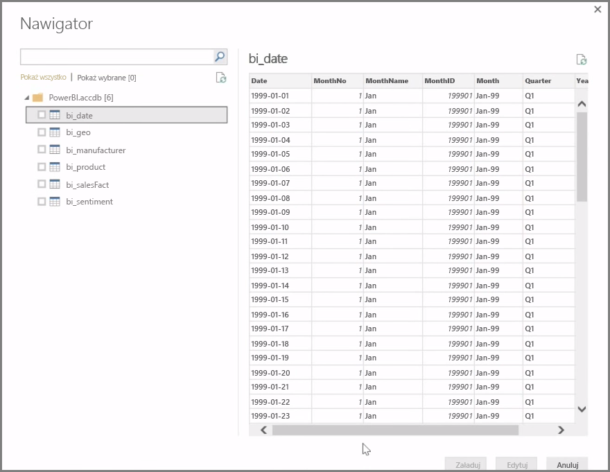
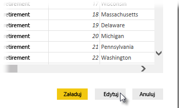

Program **Power BI Desktop** może łączyć się z całą paletą źródeł danych, w tym z lokalnymi bazami danych, skoroszytami programu Excel i usługami w chmurze. Obecnie są dostępne łączniki dla ponad 59 różnych usług w chmurze, takich jak GitHub i Marketo, oraz można nawiązać połączenie z ogólnymi źródłami danych, takimi jak pliki XML, CSV i tekstowe oraz źródła ODBC. Usługa Power BI wyodrębnia nawet dane tabel, korzystając bezpośrednio z adresu URL witryny internetowej. Lecz zacznijmy od początku, od otworzenia programu Power BI Desktop i nawiązania połączenia z danymi.

Po uruchomieniu programu **Power BI Desktop** i przejściu przez ekran startowy możesz wybrać polecenie Pobierz dane ze wstążki na karcie **Narzędzia główne**.

Program Power BI Desktop jest aktualizowany co miesiąc, a przy każdej aktualizacji strona **Co nowego w programie Power BI Desktop** jest odświeżana za pomocą informacji o aktualizacjach, linków do blogu i linków pobierania.

W programie Power BI Desktop są dostępne różne źródła danych wielu typów. Wybierz źródło, aby nawiązać połączenie. W zależności od wyboru trzeba będzie wskazać źródło na komputerze lub w sieci albo zalogować się do usługi w celu uwierzytelnienia żądania.

Po nawiązaniu połączenia pierwszym wyświetlanym oknem jest **Nawigator**. Nawigator zawiera tabele lub jednostki ze źródła danych, a kliknięcie takiego elementu powoduje wyświetlenie podglądu jego zawartości. Możesz natychmiast zaimportować wybrane tabele lub jednostki albo wybrać polecenie **Edytuj**, aby transformować i wyczyścić dane przed importowaniem.

Po wybraniu tabel do przekazania do programu Power BI Desktop możesz załadować je do programu Power BI Desktop, wybierając przycisk **Ładuj** w prawym dolnym rogu **Nawigatora**. Czasem jednak może być potrzebne wprowadzenie zmian w tabelach przed załadowaniem ich do programu Power BI Desktop. Być może jest potrzebny tylko podzbiór klientów lub dane przefiltrowane pod kątem sprzedaży w konkretnym kraju. W takich przypadkach możesz wybrać przycisk Edytuj i filtrować lub transformować dane przed ich umieszczeniem w programie Power BI Desktop.

Od tego miejsca zaczniemy, i zmodyfikujemy nasze dane, w następnej sekcji.

