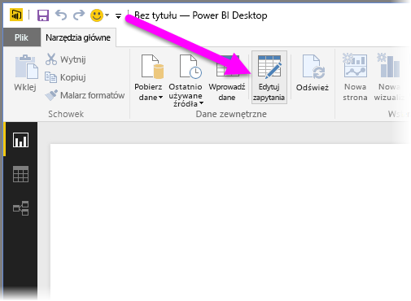
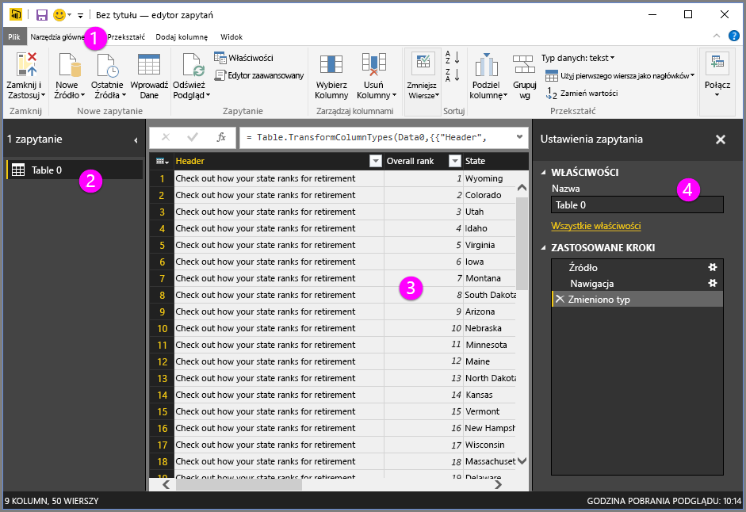
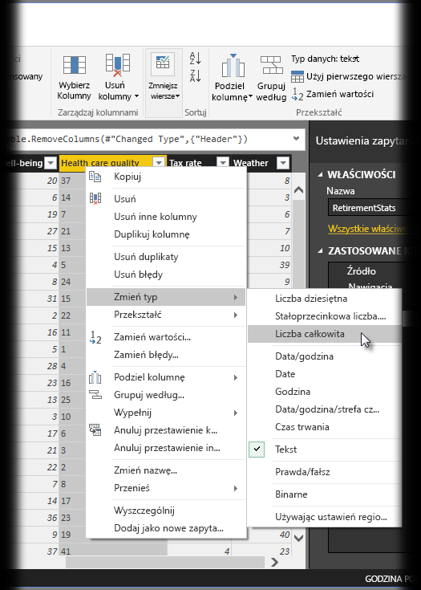
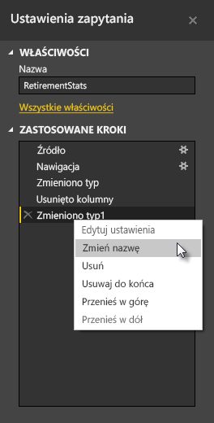
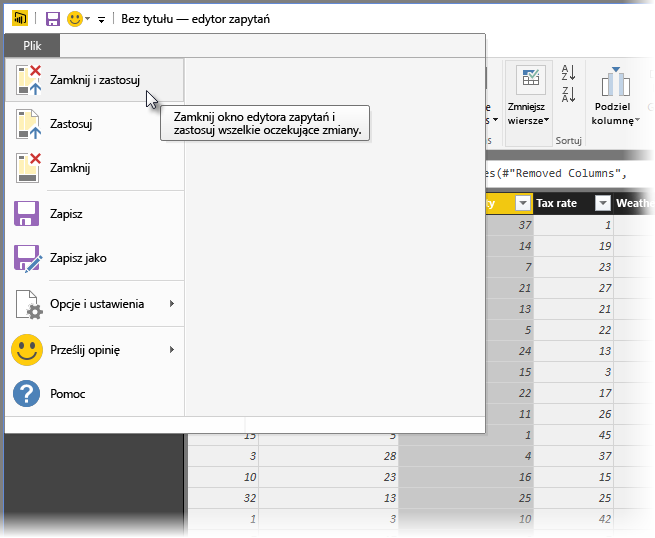
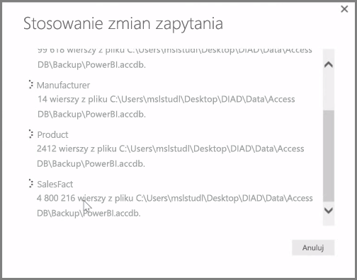

Program **Power BI Desktop** zawiera **Edytor zapytań** — wszechstronne narzędzie do kształtowania i transformowania danych pod kątem przygotowania ich na potrzeby modeli i wizualizacji. Po wybraniu polecenia Edytuj z Nawigatora zostanie uruchomiony Edytor zapytań wypełniony tabelami lub innymi jednostkami ze źródła danych.

**Edytor zapytań** możesz także uruchomić bezpośrednio z programu **Power BI Desktop** za pomocą przycisku **Edytuj zapytania** na wstążce **Narzędzia główne**.

Po załadowaniu do Edytora zapytań danych, które są gotowe do kształtowania, zostanie wyświetlonych kilka sekcji:

1. Na wstążce wiele przycisków jest teraz aktywnych, umożliwiając interakcje z danymi w zapytaniu.
2. Okienko po lewej stronie zawiera listę zapytań (po jednym dla każdej tabeli lub jednostki) — można je wybrać, wyświetlić i kształtować.
3. Środkowe okienko zawiera dane z wybranego zapytania i umożliwia kształtowanie.
4. Okno Ustawienia zapytania zawiera listę właściwości zapytania i zastosowanych kroków.

W środkowym okienku kliknięcie kolumny prawym przyciskiem myszy powoduje wyświetlenie różnych dostępnych transformacji, takich jak usunięcie kolumny z tabeli, utworzenie duplikatu kolumny z nową nazwą i zastąpienie wartości. Z tego menu możesz również podzielić kolumny tekstowe na wiele kolumn przy użyciu typowych ograniczników.

Wstążka **Edytor zapytań** zawiera dodatkowe narzędzia, takie jak zmiana typu danych kolumny, dodanie notacji naukowej lub wyodrębnienie elementów z dat (np. dnia tygodnia).

Podczas stosowania transformacji każdy krok jest wyświetlany na liście **Zastosowane kroki** w okienku **Ustawienia zapytania** po prawej stronie **Edytora zapytań**. Za pomocą tej listy możesz cofnąć lub przejrzeć zmiany, a nawet zmienić nazwę kroku. Aby zapisać transformacje, wybierz polecenie **Zamknij i zastosuj** na karcie **Narzędzia główne**.

Po wybraniu polecenia **Zamknij i zastosuj** Edytor zapytań zastosuje wprowadzone zmiany zapytania, a następnie zastosuje je w programie Power BI Desktop.

Podczas transformowania danych w **Edytorze zapytań** można zrobić wiele rzeczy, w tym zastosować zaawansowane transformacje. W następnej sekcji przyjrzymy się niektórym z tych zaawansowanych transformacji, aby dać Ci przedsmak niemal niezmierzonych sposobów, na które można transformować dane za pomocą **Edytora zapytań**.

