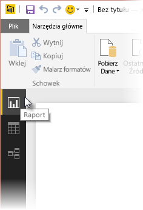

W tym artykule badamy niektóre zaawansowane techniki importowania i czyszczenia danych w programie **Power BI Desktop**. Po ukształtowaniu danych w **Edytorze zapytań** i przekazaniu ich do programu **Power BI Desktop** możesz przyjrzeć się im na kilka różnych sposobów. Program Power BI Desktop zawiera trzy różne widoki: **Raport**, **Dane** i **Relacje**. Każdy z widoków możesz wyświetlić, wybierając jego ikonę w lewej górnej części kanwy. Na poniższym obrazie jest wybrany widok **Raport**. Żółty pasek obok ikony wskazuje, który widok jest aktywny.

Aby zmienić widok, wystarczy wybrać jedną z dwóch pozostałych ikon. Żółty pasek obok ikony wskazuje, który widok jest aktywny.

Program Power BI Desktop może połączyć dane z wielu źródeł w jeden raport w dowolnym momencie procesu modelowania. Aby dodać kolejne źródła do istniejącego raportu, wybierz polecenie **Edytuj zapytania** na wstążce **Narzędzia główne**, a następnie pozycję **Nowe źródło** w **Edytorze zapytań**.

Istnieje wiele różnych źródeł danych, których można użyć w programie **Power BI Desktop**, w tym foldery. Łącząc się z folderem, można zaimportować jednocześnie dane z wielu plików, na przykład ze zbioru plików programu Excel lub plików CSV. Pliki zawarte w wybranym folderze pojawią się w **Edytorze zapytań** jako zawartość binarna, a kliknięcie ikony podwójnej strzałki w górnej części kolumny **Zawartość** spowoduje załadowanie ich wartości.

Jednym z najbardziej przydatnych narzędzi usługi Power BI jest opcja *Filtry*. Na przykład wybranie strzałki listy rozwijanej obok kolumny otwiera listę kontrolną filtrów tekstu, których można użyć do usunięcia wartości z modelu.

Ponadto możesz scalać i dołączać zapytania oraz przekształcać wiele tabel (lub dane z wielu plików w folderach) w pojedynczą tabelę, która zawiera tylko wybrane dane. Możesz użyć narzędzia **Dołącz zapytania**, aby dodać dane z nowej tabeli do istniejącego zapytania. Program Power BI Desktop próbuje dopasować kolumny w zapytaniach. Można je potem dostosować w **Edytorze zapytań**.

Narzędzie **Dodaj kolumnę niestandardową** udostępnia zaawansowanym użytkownikom opcję tworzenia wyrażeń zapytań od podstaw za pomocą wszechstronnego języka M. Możesz dodać kolumnę niestandardową opartą na instrukcjach języka zapytań M i uzyskać dane w taki sposób, jaki chcesz.

