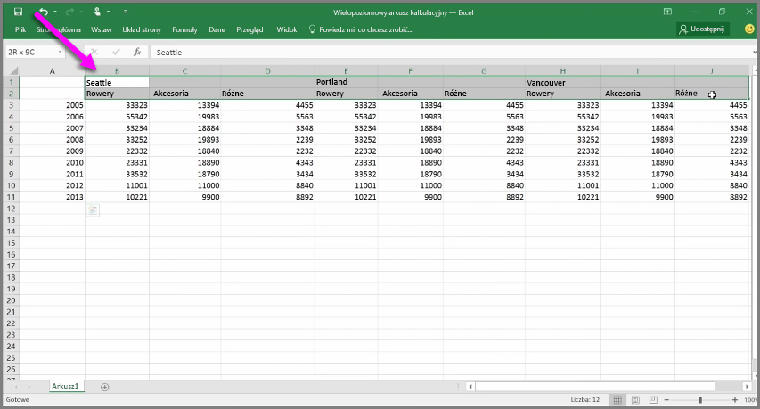
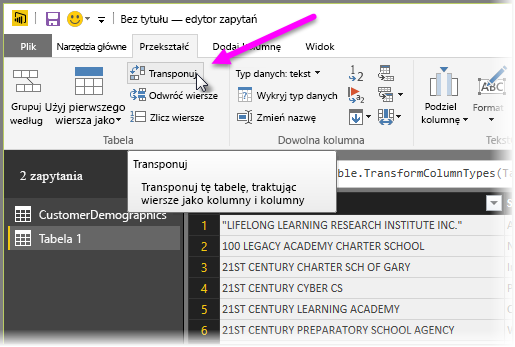
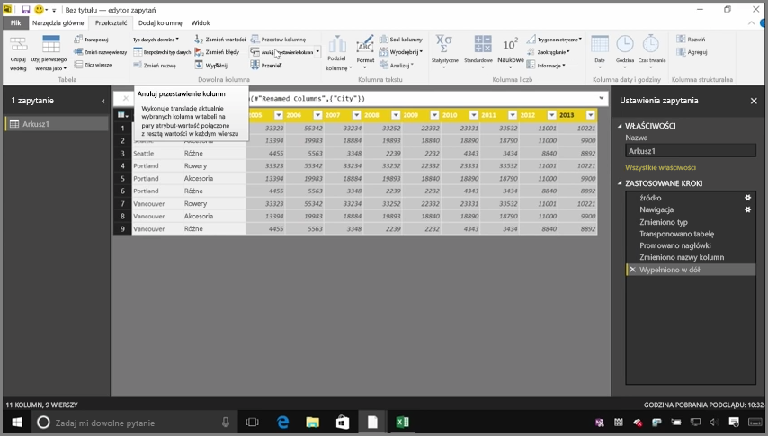
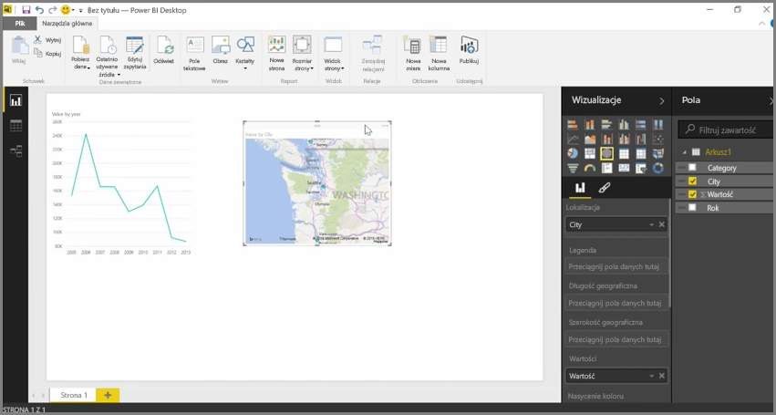

O ile usługa Power BI może importować dane z niemal dowolnego źródła, jej wizualizacje i narzędzia do modelowania działają najlepiej z danymi w postaci kolumn. Czasami dane nie są sformatowane w proste kolumny, jak często zdarza się w przypadku arkuszy kalkulacyjnych programu Excel, gdzie układ tabeli wyglądający dobrze dla ludzkiego oka nie musi być optymalny dla zautomatyzowanych zapytań. Na przykład następujący arkusz kalkulacyjny zawiera nagłówki obejmujące wiele kolumn.

Na szczęście usługa Power BI udostępnia narzędzia do szybkiego transformowania wielokolumnowych tabel w zestawy danych, których możesz użyć.

## Transponowanie danych
Na przykład polecenie **Transponuj** w **Edytorze zapytań** umożliwia przerzucenie danych (zamianę kolumn w wiersze i wierszy w kolumny), dzięki czemu dane można sprowadzić do formatu pozwalającego na korzystanie z nich.

Po wykonaniu tej czynności kilka razy, zgodnie z opisem w filmie wideo, tabela zacznie przekształcać się w coś, z czym usługa Power BI może łatwiej pracować.

## Formatowanie danych
Konieczne może być także sformatowanie danych, dzięki czemu usługa Power BI będzie mogła je prawidłowo sklasyfikować i zidentyfikować po zaimportowaniu.

Za pomocą kliku transformacji, w tym *podwyższenia poziomu wierszy do nagłówków*, użycia polecenia **Wypełnij** do zastąpienia wartości *null* wartością powyżej lub poniżej w danej kolumnie i polecenia **Anuluj przestawienie kolumn**, możesz wyczyścić dane, tworząc zestaw danych do użycia w usłudze Power BI.

Usługa Power BI pozwala na eksperymentowanie z transformacjami danych i określanie typów dla danych kolumnowych, co pozwala usłudze Power BI na pracę z nimi. Pamiętaj, że wszystkie wykonywane działania są rejestrowane w sekcji Zastosowane kroki w Edytorze zapytań, więc jeśli transformacja nie działa w zamierzony sposób, możesz po prostu kliknąć pozycję **x** obok kroku, aby go cofnąć.

## Tworzenie wizualizacji
Gdy dane są już w formacie odpowiednim dla usługi Power BI, dzięki transformacji lub czyszczeniu danych, możesz rozpocząć tworzenie wizualizacji.

## Następne kroki
**Gratulacje!** Ta część kursu **Nauka z przewodnikiem** dotyczącego usługi Power BI została ukończona. Teraz wiesz, jak **pobrać dane** do programu Power BI Desktop i jak *kształtować* lub *transformować* te dane, dzięki czemu możesz tworzyć atrakcyjne wizualizacje.

Następnym krokiem poznawania mechanizmów działania usługi Power BI i zaprzęgania jej do pracy *dla siebie* jest zrozumienie, na czym polega **modelowanie**. Jak już wiesz, **zestaw danych** to podstawowy blok konstrukcyjny usługi Power BI, lecz niektóre zestawy danych mogą być złożone i oparte na wielu różnych źródłach danych. Czasami musisz też dodać coś od siebie (np. *pole*) do tworzonego zestawu danych.

W następnej sekcji poznasz **modelowanie** i wiele więcej. Do zobaczenia!

