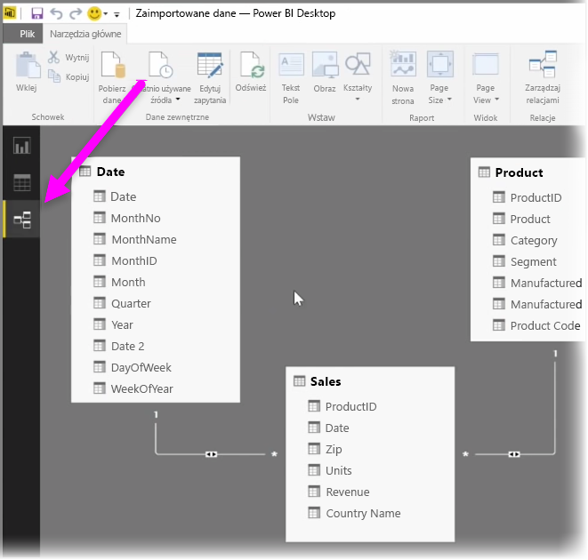
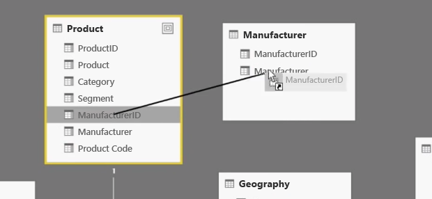
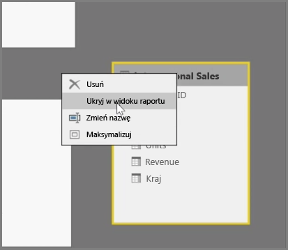
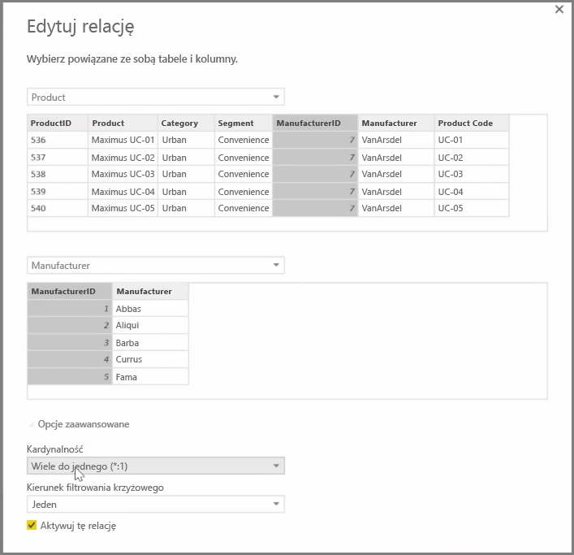

Usługa Power BI pozwala wizualnie określać relacje między tabelami lub elementami. Aby wyświetlić dane w widoku diagramu, użyj **widoku Relacje**, który znajduje się na samym końcu z lewej strony ekranu, obok kanwy raportu.

W widoku **Relacje** zostanie wyświetlony blok, który reprezentuje poszczególne tabele i ich kolumny, a także linie między nimi przedstawiające relacje.

Dodawanie i usuwanie relacji jest proste. Aby usunąć relację, kliknij ją prawym przyciskiem myszy i wybierz pozycję **Usuń**. Aby utworzyć relację, przeciągnij i upuść pola, między którymi chcesz utworzyć połączenia w tabelach.

Aby ukryć tabelę lub kolumnę w raporcie, kliknij ją prawym przyciskiem myszy w widoku Relacja i wybierz pozycję **Ukryj w widoku raportu**.

Aby uzyskać bardziej szczegółowy widok relacji danych, wybierz pozycję **Zarządzanie relacjami** na karcie **Narzędzia główne**. Spowoduje to otwarcie okna dialogowego **Zarządzanie relacjami**, w którym zostaną wyświetlone relacje w postaci listy zamiast diagramu wizualnego. W tym miejscu możesz wybrać pozycję **Autowykrywanie**, aby znaleźć relacje w nowych lub zaktualizowanych danych. Wybierz pozycję **Edytuj** w oknie dialogowym **Zarządzanie relacjami**, aby ręcznie edytować relacje. W tym miejscu możesz również znaleźć opcje zaawansowane, aby określić *Kardynalność* i *Filtr krzyżowy* kierunku relacji.

Opcje kardynalności to *Wiele do jednego* i *Jeden do jednego*. *Wiele do jednego* jest faktycznie relacją typu wymiarowego. Przykład: tabela sprzedaży zawierająca wiele wierszy dla każdego produktu połączona z tabelą zawierającą listę produktów w osobnych, unikatowych wierszach. *Jeden-do-jednego* jest relacją używaną często do łączenia pojedynczych wpisów w tabelach odwołań.

Domyślnie relacje są określane tak, aby korzystały z filtru krzyżowego w obu kierunkach. Filtrowanie krzyżowe tylko w jednym kierunku ogranicza niektóre funkcje modelowania w relacji.

Określenie dokładnych relacji między danymi umożliwia tworzenie skomplikowanych obliczeń między wieloma elementami danych.

