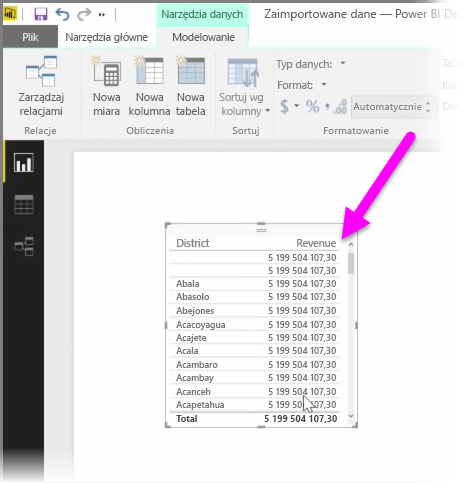
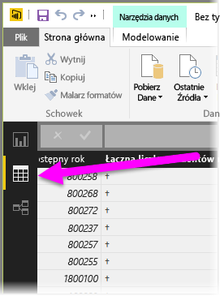
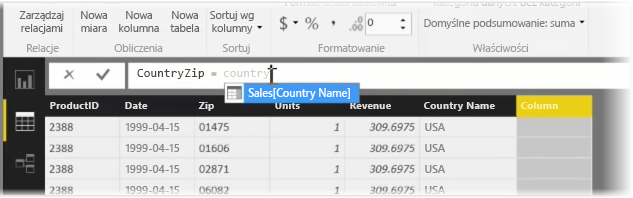
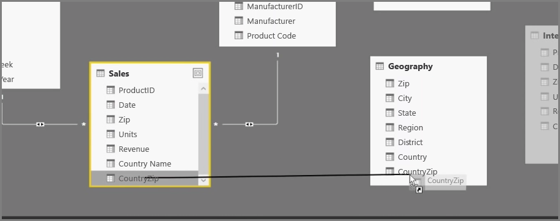
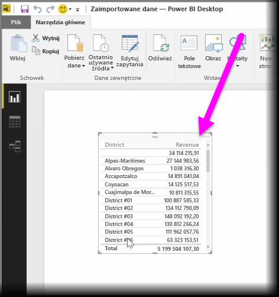

Tworzenie kolumn obliczeniowych to prosty sposób na wzbogacanie i ulepszanie danych. **Kolumna obliczeniowa** to nowa kolumna, utworzona przez zdefiniowanie obliczeń, które przekształcają lub łączą co najmniej dwa elementy istniejących danych. Na przykład możesz utworzyć nową kolumnę, łącząc dwie kolumny w jedną.

Jednym z powodów, dla których warto utworzyć kolumnę obliczeniową, jest ustanowienie relacji między tabelami, gdy nie istnieją unikatowe pola, które mogą posłużyć do ustanowienia relacji. Brak relacji staje się oczywisty, gdy tworzysz prostą wizualizację tabeli w programie Power BI Desktop i otrzymujesz tę samą wartość dla wszystkich wpisów, chociaż wiesz, że dane źródłowe są różne.

W celu utworzenia relacji za pomocą unikatowych pól danych możesz na przykład utworzyć nową kolumnę obliczeniową „Pełny numer telefonu”, łącząc wartości z kolumn „Numer kierunkowy” i „Numer lokalny”, gdy te wartości istnieją w Twoich danych. Kolumny obliczeniowe to przydatne narzędzie do szybkiego tworzenia modeli i wizualizacji.

Aby utworzyć kolumnę obliczeniową, wybierz pozycję **Widok danych** w programie Power BI Desktop po lewej stronie kanwy raportu.

Na karcie Modelowanie wybierz pozycję **Nowa kolumna**. Spowoduje to włączenie paska formuły, na którym możesz wprowadzać obliczenia przy użyciu języka DAX (Data Analysis Expressions — wyrażenia analizy danych). DAX jest zaawansowanym językiem formuł, używanym również w programie Excel, który umożliwia przeprowadzanie niezawodnych obliczeń. Podczas wpisywania formuły program Power BI Desktop wyświetla zgodne formuły lub elementy danych, aby ułatwić i przyspieszyć tworzenie formuły.

Gdy wprowadzasz wyrażenie, pasek formuły usługi Power BI sugeruje określone funkcje języka DAX i powiązane kolumny danych.

Po utworzeniu w każdej tabeli kolumn obliczeniowych można używać ich jako unikatowego klucza do ustanawiania relacji między nimi. Przechodząc do widoku **Relacja**, możesz następnie przeciągnąć pole z jednej tabeli do drugiej w celu utworzenia relacji.

Po powrocie do widoku **Raport** możesz teraz zobaczyć inną wartość dla każdego okręgu.

Po utworzeniu kolumn obliczeniowych możesz także wykonywać wszelkiego rodzaju inne czynności.

