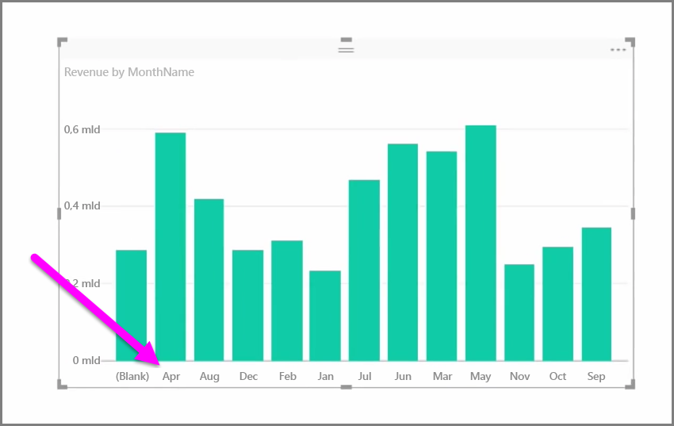
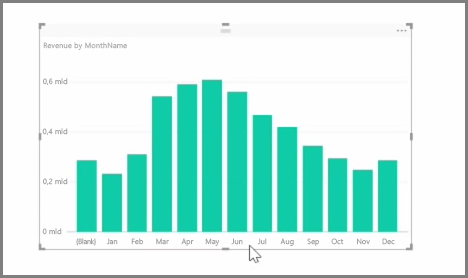

Zaimportowane dane często zawierają pola, których tak naprawdę nie potrzebujesz do zadań raportowania i wizualizacji, ponieważ są to informacje dodatkowe lub dane są już dostępne w innej kolumnie. W programie Power BI Desktop znajdują się narzędzia do optymalizacji danych i zwiększania ich użyteczności w procesie tworzenia raportów i wizualizacji oraz wyświetlania raportów udostępnionych.

## Ukrywanie pól
Aby ukryć kolumnę w okienku **Pola** programu Power BI Desktop, kliknij ją prawym przyciskiem myszy i wybierz pozycję **Ukryj**. Pamiętaj, że ukryte kolumny nie są usuwane. Jeśli to pole jest używane w istniejących wizualizacjach, dane nadal znajdują się w tych wizualizacjach i można używać ich także w innych wizualizacjach. Ukryte pole po prostu nie jest wyświetlane w okienku **Pola**.

Jeśli wyświetlasz tabele w widoku **Relacje**, ukryte pola wyróżniają się tym, że są wygaszone. Również w tym przypadku ich dane są nadal dostępne i wciąż są częścią modelu. Po prostu są ukryte w widoku. Dowolne pole, które zostało ukryte, możesz w każdej chwili odkryć, klikając je prawym przyciskiem myszy i wybierając pozycję **Odkryj**.

## Sortowanie danych wizualizacji według innego pola
Narzędzie **Sortuj według kolumny** dostępne na karcie **Modelowanie** bardzo przydaje się do sprawdzania, czy dane są wyświetlane w zamierzonej kolejności.

Typowym przykładem są dane zawierające nazwę miesiąca, które domyślnie są sortowane alfabetycznie, dlatego na przykład „August” (sierpień) pojawia się przed „February” (luty).

W takim przypadku problem można rozwiązać, wybierając pole z listy Pola, a następnie wybierając pozycję **Sortuj według kolumny** na karcie **Modelowanie** i wybierając pole do sortowania. W tym przypadku opcja sortowania kategorii „MonthNo” porządkuje kolejność miesięcy zgodnie z oczekiwaniami.

Innym sposobem zoptymalizowania informacji w celu ich poprawnej obsługi jest ustawienie typu danych dla pola. Aby zmienić typ danych z poziomu kanwy raportu, zaznacz kolumnę w okienku **Pola**, a następnie z menu rozwijanego **Format** wybierz jedną z opcji formatowania. Wszystkie utworzone wizualizacje, w których jest wyświetlane to pole, zostaną zaktualizowane automatycznie.

