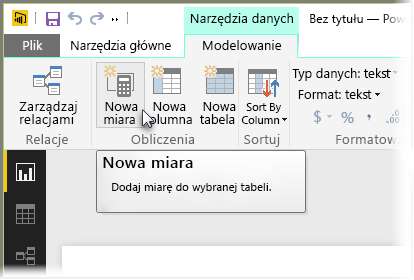
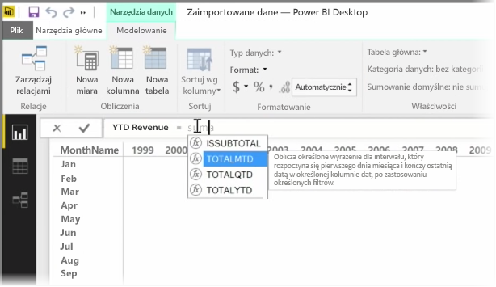
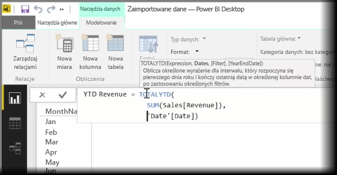
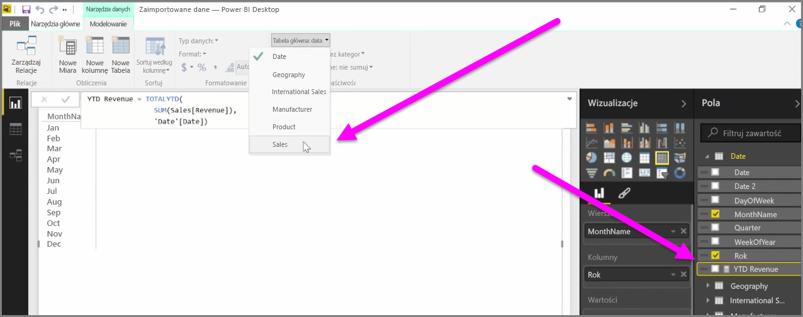

*Miara* to obliczenie, które istnieje w Twoim modelu danych usługi Power BI. Aby utworzyć miarę, w widoku **Raport** wybierz pozycję **Nowa miara** na karcie **Modelowanie**.

Jedną z największych zalet języka DAX (języka wyrażeń analizy danych w usłudze Power BI) jest mnóstwo przydatnych funkcji, szczególnie związanych z obliczeniami opartymi na czasie, takich jak *Od początku roku* lub *Z roku na rok*. Używając języka DAX, możesz raz zdefiniować miarę czasu, a następnie podzielić ją na dowolną liczbę różnych pól z poziomu modelu danych.

W usłudze Power BI zdefiniowane obliczenie nosi nazwę *miary*. Aby utworzyć *miarę*, wybierz pozycję **Nowa miara** na karcie **Narzędzia główne**. Spowoduje to otwarcie paska formuły, na którym możesz wprowadzić wyrażenie DAX definiujące miarę. Podczas wprowadzania obliczenia usługa Power BI sugeruje odpowiednie funkcje języka DAX i pola danych. Otrzymujesz także etykietkę narzędzia objaśniającą niektóre parametry składni i funkcji.

Jeśli obliczenie jest wyjątkowo długie, możesz wprowadzać dodatkowe podziały wierszy w Edytorze wyrażeń, naciskając klawisze **ALT-Enter**.

Po utworzeniu nowej miary będzie ona widoczna w jednej z tabel w okienku **Pola**, które znajduje się po prawej stronie ekranu. Usługa Power BI wstawia nową miarę do aktualnie wybranej tabeli, a ponieważ nie ma znaczenia, w którym dokładnie miejscu danych znajduje się miara, możesz ją łatwo przenosić, wybierając miarę i używając menu rozwijanego **Tabela główna**.

Miary można używać jak każdej innej kolumny w tabeli: wystarczy przeciągnąć ją i upuścić na pola kanwy raportu lub wizualizacji. Miary integrują się także z fragmentatorami, na bieżąco dzieląc dane na segmenty, co oznacza, że możesz zdefiniować miarę raz i używać jej w wielu różnych wizualizacjach.

Funkcja **Oblicz** języka DAX jest zaawansowaną funkcją zawierającą mnóstwo przydatnych obliczeń. Jest ona szczególnie przydatna w przypadku raportowania i wizualizacji danych finansowych.

