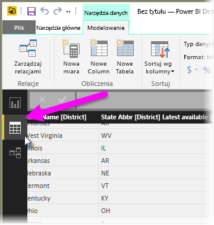
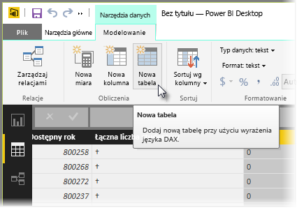
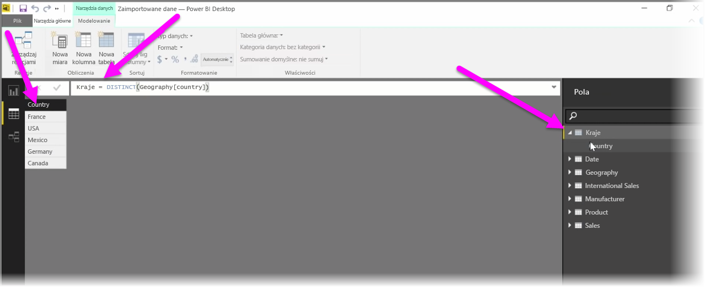

Tabele obliczeniowe są funkcją języka DAX umożliwiającą wyrażanie całego zakresu nowych funkcji modelowania. Na przykład jeśli chcesz przeprowadzać różnego rodzaju łączenia ze scalaniem lub na bieżąco tworzyć nowe tabele na podstawie wyników formuły funkcjonalnej, możesz to zrobić za pomocą tabel obliczeniowych.

Aby utworzyć tabelę obliczeniową, w programie Power BI Desktop przejdź do pozycji **Widok danych**, którą możesz aktywować po lewej stronie kanwy raportu.

Wybierz pozycję **Nowa tabela** na karcie Modelowanie, aby otworzyć pasek formuły.

Po lewej stronie znaku równości wpisz nazwę nowej tabeli, a po prawej — obliczenia, za pomocą których chcesz utworzyć tę tabelę. Po zakończeniu obliczeń nowa tabela zostanie wyświetlona w okienku Pola używanego modelu.

Utworzonej tabeli obliczeniowej możesz używać tak jak każdej innej tabeli w relacjach, formułach i raportach.

