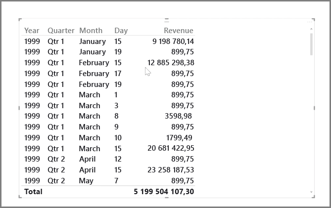
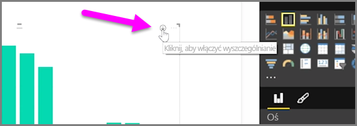
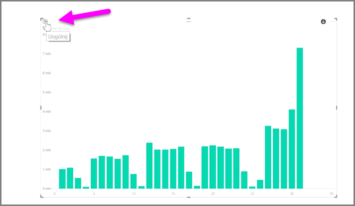
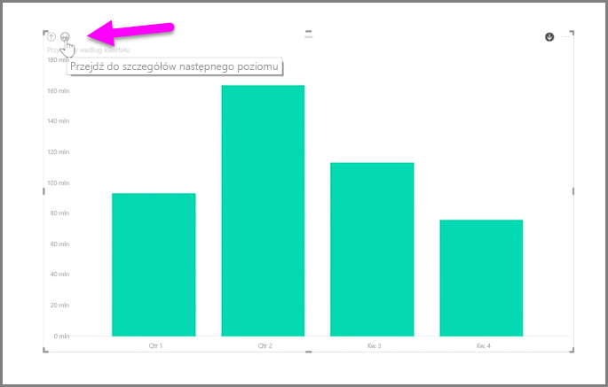
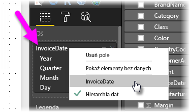

Analizowanie danych opartych na czasie za pomocą usługi Power BI jest łatwe. Narzędzia modelowania w programie Power BI Desktop zawierają automatycznie generowane pola, które pozwalają jednym kliknięciem przechodzić przez lata, kwartały, miesiące i dni.  

Gdy utworzysz w raporcie wizualizację tabeli za pomocą pola daty, program Power BI Desktop automatycznie uwzględni podziały na okresy. Na przykład pojedyncze pole daty w tabeli **Date** zostało automatycznie rozdzielone przez usługę Power BI na pola Year, Quarter, Month i Day, jak pokazano na poniższej ilustracji.

Dane w wizualizacjach są domyślnie wyświetlane na poziomie *roku*, ale możesz to zmienić, włączając funkcję **Przechodzenie do szczegółów** w prawym górnym rogu wizualizacji.

Teraz kliknięcie słupka lub linii na wykresie powoduje przejście do następnego poziomu hierarchii czasu, na przykład z *lat* do *kwartałów*. Możesz kontynuować przechodzenie, aż dojdziesz do najbardziej szczegółowego poziomu hierarchii, którym w tym przykładzie są *dni*. Aby cofnąć się w hierarchii czasu, kliknij pozycję **Uogólnij** w lewym górnym rogu wizualizacji.

Możesz również przejść przez wszystkie dane wyświetlane na wizualizacji zamiast przez jeden wybrany okres, używając ikony z podwójną strzałką **Przejdź przez wszystkie**, która również znajduje się w prawym górnym rogu wizualizacji.

Dopóki model zawiera pole daty, usługa Power BI automatycznie generuje różne widoki dla różnych hierarchii czasu.

Aby wrócić do poszczególnych dat, zamiast korzystania z hierarchii dat, wystarczy kliknąć prawym przyciskiem myszy nazwę kolumny w obszarze **Pola** (na poniższej ilustracji nazwa kolumny to *InvoiceDate*), a następnie z wyświetlonego menu wybrać nazwę kolumny zamiast pozycji **Hierarchia dat**. Na wizualizacji zostaną wyświetlone dane na podstawie danych z tej kolumny, bez korzystania z hierarchii dat. Chcesz wrócić do korzystania z hierarchii dat? Żaden problem — po prostu kliknij ponownie prawym przyciskiem myszy i wybierz z menu pozycję **Hierarchia dat**.

## Następne kroki
**Gratulacje!** Ta część kursu **Nauka z przewodnikiem** dotyczącego usługi Power BI została ukończona. Masz już wiedzę na temat *modelowania* danych, więc możesz zapoznać się z interesującym zagadnieniem w następnej części: **Wizualizacje**.

Jak wspomniano wcześniej, ten kurs buduje Twoją wiedzę w kolejności określonej przez typowy przepływ pracy w usłudze Power BI:

* Umieszczenie danych w programie **Power BI Desktop** i utworzenie raportu.
* Opublikowanie danych w usłudze Power BI, w której można tworzyć nowe **wizualizacje** i pulpity nawigacyjne.
* **Udostępnienie** pulpitów nawigacyjnych innym użytkownikom — szczególnie tym, którzy pracują mobilnie.
* Wyświetlenie udostępnionych pulpitów nawigacyjnych i raportów oraz korzystanie z nich w aplikacjach **Power BI Mobile**.

Być może nie całą pracę wykonasz samodzielnie, ale *rozumiesz*, jak tworzy się te pulpity nawigacyjne i jak łączą się one z danymi, a po ukończeniu tego kursu będziesz w stanie utworzyć własny.

Do zobaczenia w następnej sekcji!

