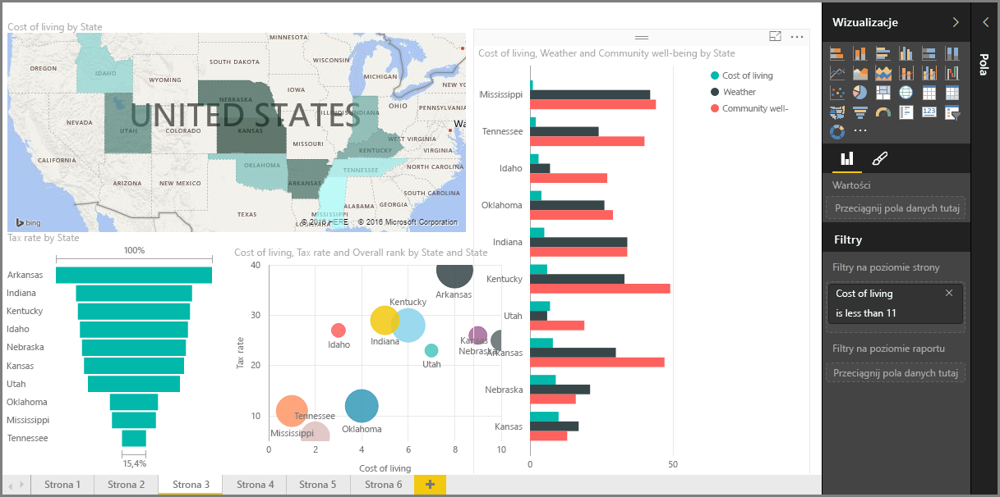

Witamy w części **Wizualizacje** kursu **Nauka z przewodnikiem** dotyczącego usługi Power BI. Przygotuj się na interesujący i pouczający przewodnik po różnorodnych wizualizacjach dostępnych w usłudze Power BI. A to nie wszystkie wizualizacje — cały czas powstają nowe!

Oczywiście wizualizacje są wynikiem końcowym każdej analizy biznesowej. Chcemy zebrać dane, przedstawić je w atrakcyjny i wnikliwy sposób, a także *pokazać*, co się wyróżnia. Usługa Power BI udostępnia szeroką gamę atrakcyjnych wizualizacji (i niemal nieograniczone możliwości ich dostosowywania), dlatego ta część jest bardzo ważna.

Może się wydawać, że w tej części znajduje się mnóstwo tematów, ale nie martw się: każdy temat jest krótki, wypełniony wizualizacjami i łatwy do przyswojenia. Prawdopodobnie okaże się, że krążysz po tej części, wyobrażając sobie, jak zaprezentować dane za pomocą tych wizualizacji.

Zaczniemy od sztandarowych wizualizacji — prostych wizualizacji, które wszyscy znamy — i upewnimy się, że wiesz o nich wszystko. Następnie przejdziemy do bardziej zaawansowanych (a przynajmniej nieco mniej popularnych) i wypełnimy zestaw narzędzi do tworzenia raportów.

Baw się dobrze — możesz się tutaj wiele nauczyć.

## Wprowadzenie do wizualizacji w usłudze Power BI
Wizualizacja danych jest jednym z głównych składników usługi Power BI — podstawowym blokiem konstrukcyjnym, który zdefiniowaliśmy we wcześniejszej części tego kursu — a tworzenie wizualizacji jest najprostszym sposobem znajdowania i udostępniania szczegółowych danych.

Domyślnie usługa Power BI zawiera szeroką gamę dostępnych wizualizacji: od prostych wykresów słupkowych, przez wykresy kołowe do map, a nawet jeszcze bardziej ezoteryczne propozycje, takie jak kaskady, lejki, mierniki itd. W programie Power BI Desktop znajdują się także zaawansowane narzędzia formatowania stron, takie jak kształty i obrazy, które pomagają ożywić raport.

