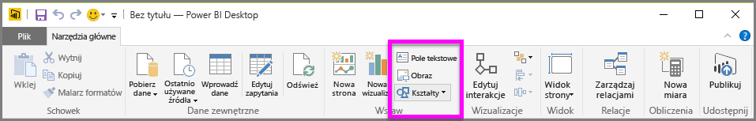
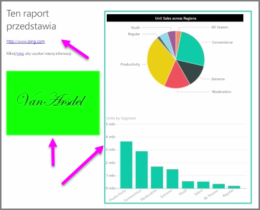

Oprócz wizualizacji powiązanych z danymi, możesz również dodawać elementy statyczne, takie jak pola tekstowe, obrazy i kształty poprawiające wygląd raportów. Aby dodać element wizualizacji, wybierz pozycję **Pole tekstowe**, **Obraz** lub **Kształt** na karcie **Narzędzia główne**.

**Pola tekstowe** to idealna metoda wyświetlania dużych tytułów, podpisów lub krótkich akapitów informacji wraz z wizualizacjami. Pola tekstowe mogą zawierać linki zarówno w postaci napisanego adresu URL, jak też utworzone przez wyróżnienie zakotwiczonego wyrażenia i wybranie symbolu linku na pasku opcji pola tekstowego. Adresy URL możesz umieszczać w polach tekstowych, a usługa Power BI automatycznie wykryje linki i sprawi, że będą aktywne.

Wybranie pozycji **Obraz** spowoduje otwarcie przeglądarki plików, w której możesz wybrać obraz z komputera lub innego źródła sieciowego. Domyślnie podczas zmiany rozmiaru obrazu w raporcie proporcje są zachowywane, ale można to wyłączyć w opcjach formatowania wizualizacji.

**Kształty** mają pięć różnych opcji dla formularza, w tym prostokąty i strzałki. Kształty mogą być nieprzezroczyste lub przezroczyste z kolorowym obramowaniem. (Ta druga opcja przydaje się w przypadku tworzenia obramowania wokół grup wizualizacji).

