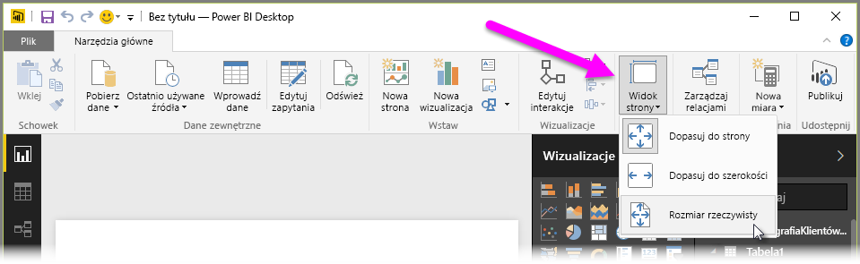

Program Power BI Desktop umożliwia modyfikowanie układu i formatowania stron raportu, na przykład ich rozmiaru i orientacji.

Użyj menu **Widok strony** na karcie Narzędzia główne, aby zmienić sposób skalowania stron raportu. Dostępne opcje to **Dopasuj do strony** (ustawienie domyślne), **Dopasuj do szerokości** i **Rzeczywisty rozmiar**.

Można również zmienić rozmiar poszczególnych stron. Domyślnie strony raportu mają proporcje 16:9. Aby zmienić rozmiar strony, upewnij się, że nie są zaznaczone żadne wizualizacje, wybierz ikonę pędzla w okienku wizualizacji, a następnie wybierz pozycję **Rozmiar strony** w celu rozszerzenia tej sekcji.

Opcje rozmiaru strony obejmują pozycje 4x3 (współczynnik proporcji bardziej zbliżony do kwadratowego) i Dynamiczny (strona jest rozciągana w celu wypełnienia dostępnego miejsca). Dla raportów dostępny jest też standardowy rozmiar Letter. Należy pamiętać, że po zmianie rozmiaru strony może być konieczna zmiana rozmiaru wizualizacji, aby zmieściły się one w całości na kanwie.

Można również określić niestandardowy rozmiar strony, ustawiając rozmiar w calach lub pikselach i zmieniając kolor tła całego raportu.

Innym rozwiązaniem jest wybranie Cortany w celu zmiany rozmiaru raportu, aby mógł on być użyty jako wynik wyszukiwania przy użyciu Cortany.

