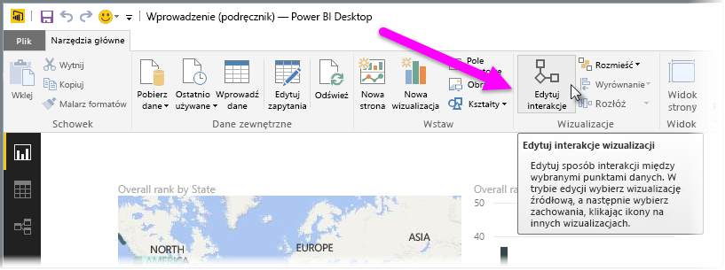
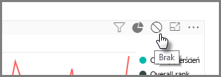
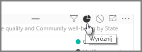
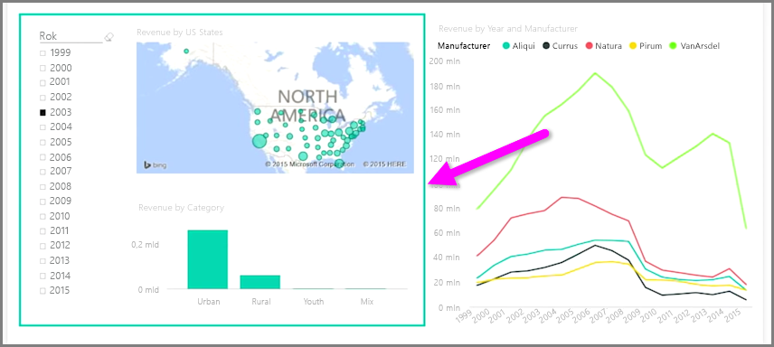

Jeśli masz wiele wizualizacji na tej samej stronie raportu, to wybranie określonego segmentu przez jego kliknięcie lub użycie fragmentatora wpłynie na wszystkie wizualizacje na tej stronie. Jednak w niektórych przypadkach zachodzi potrzeba wycięcia tylko konkretnych wizualizacji. Jest to szczególnie istotne podczas korzystania z elementów, takich jak wykresy punktowe, w przypadku których ograniczenie danych do konkretnego segmentu spowoduje istotną zmianę znaczenia. Na szczęście program Power BI Desktop umożliwia sterowanie sposobem przepływania interakcji między wizualizacjami.

Aby zmienić interakcje między wizualizacjami, wybierz pozycję **Edytuj** w sekcji Wizualizacje na karcie **Narzędzia główne** wstążki, aby włączyć **Tryb edycji**.

>[!NOTE]
>Ikona **Edytuj interakcje** w programie Power BI Desktop zmieniła się, ponieważ zarejestrowano film wideo.
> 
> 

Teraz po wybraniu wizualizacji na kanwie raportu zobaczysz małą nieprzezroczystą ikonę *filtru* w prawym górnym rogu każdej wizualizacji, której dotyczy zmiana. Aby wykluczyć wizualizację z interakcji, kliknij symbol *Brak* w prawym górnym rogu obok ikony *filtru*.

W niektórych przypadkach można dostosować typ interakcji filtru zachodzącej między wizualizacjami. Po włączeniu opcji **Tryb edycji** wybierz wizualizację, do której ma zostać zastosowany filtr. Jeśli jest możliwa zmiana typu interakcji na inną wizualizację, obok ikony filtru w prawym górnym rogu pojawi się ikona *wykresu kołowego*.

Kliknij ikonę *wykresu kołowego*, aby wyróżnić segmentowane dane. W przeciwnym razie dane zostaną przefiltrowane. Tak jak wcześniej możesz kliknąć ikonę *Brak*, aby usunąć wszystkie interakcje.

Przydatną funkcją podczas projektowania jest możliwość narysowania przezroczystego kształtu obejmującego wizualizacje, które wchodzą ze sobą w interakcje, co jest wyraźną wskazówką dla użytkownika, że mają one między sobą relacje interakcji.

