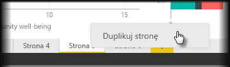

Poszczególne strony raportu mogą być całkiem złożone, z wieloma wizualizacjami mającymi konkretne sposoby interakcji i precyzyjne formatowanie. Czasami podczas tworzenia raportu może zajść potrzeba użycia takich samych wizualizacji i układów w dwóch różnych tematach stron. Jeśli na przykład utworzono właśnie stronę raportu dotyczącą przychodu brutto, może się okazać, że potrzebna będzie prawie identyczna strona dotycząca przychodu netto.

Ponowne utworzenie całego raportu będzie trudnym zadaniem, ale korzystając z programu Power BI Desktop, można po prostu zduplikować stronę raportu.

Kliknij prawym przyciskiem myszy kartę, którą chcesz skopiować, a następnie wybierz polecenie **Duplikuj stronę**.

Później można odpowiednio zmienić nazwę nowej karty strony, zaktualizować tytuł tekstowy, jeśli istnieje, a także zaktualizować wizualizacje za pomocą nowego pola, które ma być śledzone.

