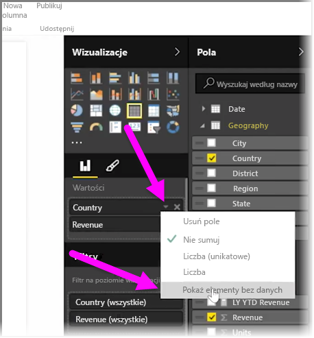
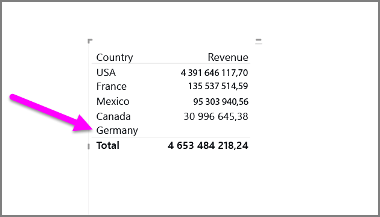
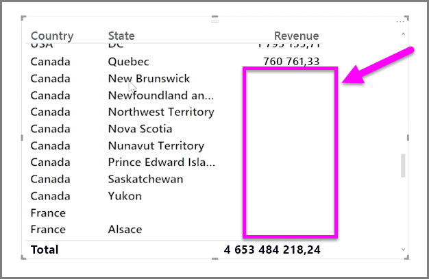

Domyślnie nagłówki kolumn są wyświetlane w raportach tylko wtedy, gdy zawierają one dane. Na przykład jeśli były wyświetlane przychody według kraju, ale w Norwegii nie było sprzedaży, ten kraj nie zostanie wyświetlony w żadnym miejscu wizualizacji.

Aby wyświetlić puste kategorie, kliknij strzałkę w dół w polu, które ma zostać zmienione w okienku **Wizualizacje**, i wybierz pozycję **Pokaż elementy bez danych**.

Wszelkie puste kolumny pojawią się teraz w wizualizacji z pustymi wartościami.

Po wybraniu pozycji **Pokaż elementy bez danych** dla dowolnego pola w okienku **Wizualizacje** to ustawienie zostanie zastosowane do wszystkich pól wyświetlanych w okienku Wizualizacje. Jeśli zostanie więc dodane kolejne pole, wszystkie jego elementy, które nie zawierają danych, również będą wyświetlane, bez konieczności ponownego użycia menu rozwijanego.

