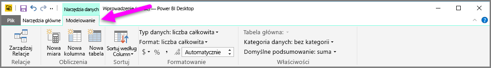
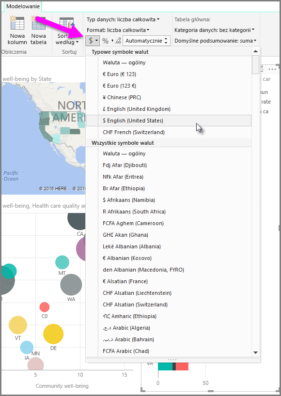
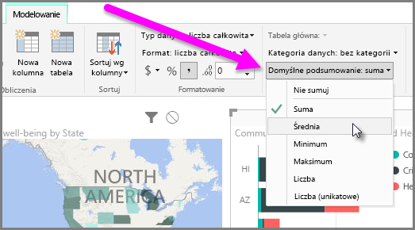
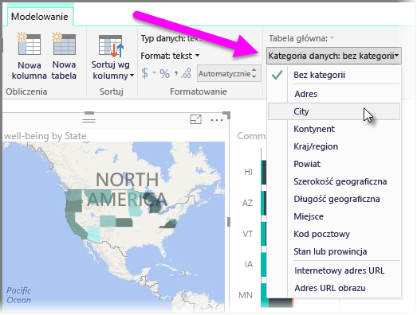

Usługa Power BI ma właściwości, które można przypisać do pól w modelu. Ułatwiają one raportowanie, wizualizowanie i prezentowanie danych w bardziej przejrzysty sposób. Na przykład czasami może się okazać, że trzeba obliczyć średnią z wymienionych liczb, ale usługa Power BI automatycznie oblicza sumę tych liczb. W usłudze Power BI można dopasować sposób podsumowywania prezentowanych liczb.

## Liczbowa kontrola nad podsumowaniem
W tym przykładzie zostanie przedstawiony sposób sterowania podsumowywaniem pól z danymi liczbowymi w usłudze Power BI.

Wybierz wizualizację na kanwie raportu, a następnie wybierz pole w okienku **Pola**. Na wstążce zostanie wyświetlona karta **Modelowanie** z opcjami formatowania danych i ich właściwościami.

Za pomocą listy rozwijanej z symbolem waluty można wybrać typ używanego symbolu waluty, jak pokazano na poniższej ilustracji.

Istnieje wiele różnych opcji formatowania pól. Na przykład można zmienić format z walutowego na procentowy.

Istnieje również możliwość zmiany sposobu podsumowywania danych w usłudze Power BI. Wybierz ikonę **Sumowanie domyślne**, aby zmienić sposób podsumowywania pola, na przykład na wyświetlanie sumy, liczby lub średniej.

## Zarządzanie danymi lokalizacji i zwiększanie ich przejrzystości
Podobne zmiany można wprowadzić podczas wykreślania lokalizacji na mapie. Wybierz mapę, a następnie w okienku **Pola** zaznacz pole, którego używasz jako wartości *lokalizacji*. Na karcie **Modelowanie** wybierz pozycję **Kategoria danych**, a następnie w menu rozwijanym wybierz kategorię, która reprezentuje dane lokalizacji. Na przykład wybierz stan, powiat lub miasto.

