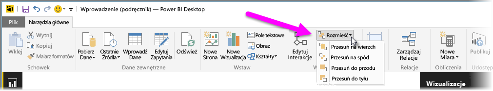
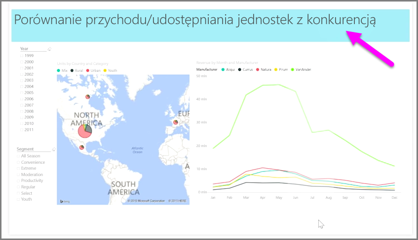

Jeśli w raporcie znajduje się wiele elementów, usługa Power BI umożliwia zarządzanie sposobem ich wzajemnego nakładania się. Sposób ułożenia elementów w warstwy lub ich umieszczenia jednych na drugich jest często określany jako porządek osi z.

Aby zarządzać porządkiem osi z elementów w raporcie, zaznacz element i użyj przycisku **Rozmieść** znajdującego się na karcie **Narzędzia główne** wstążki w celu zmiany jego porządku osi z.

Za pomocą opcji znajdujących się w menu przycisku **Rozmieść** można rozmieścić elementy w raporcie w określonej, wybranej przez Ciebie kolejności. Wizualizację można przenieść o jeden poziom do przodu lub do tyłu bądź wysłać go na sam wierzch lub na sam spód.

Przycisk Rozmieść jest szczególnie użyteczny podczas korzystania z kształtów jako dekoracyjnych teł lub obramowań bądź w celu wyróżnienia konkretnych sekcji wykresu lub grafu. Kształtów można również używać do tworzenia tła, co widać na następującym obrazie, gdzie jasnoniebieski prostokąt został użyty jako tło dla tytułu raportu.

