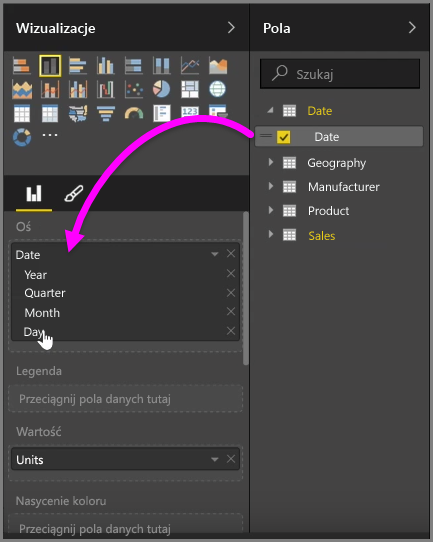
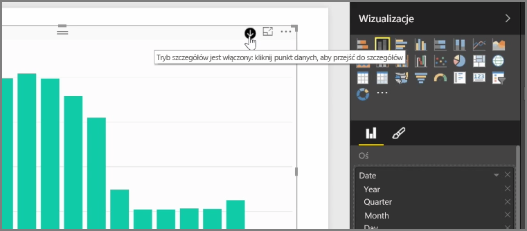
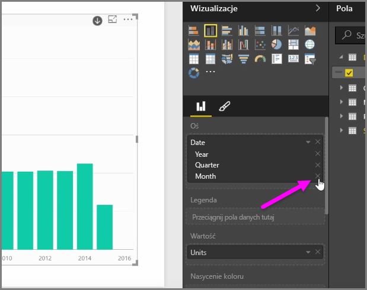
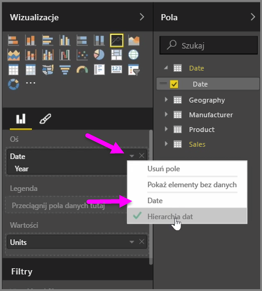
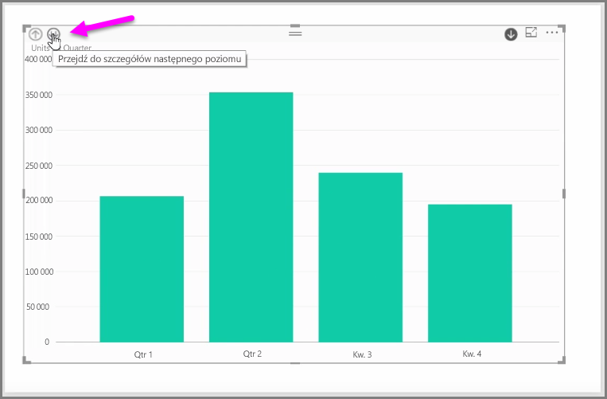

Po dodaniu pola *Date* do wizualizacji w zasobniku pól *Oś* usługa Power BI automatycznie dodaje hierarchię czasu, która zawiera *Year*, *Quarter*, *Month* i *Day*. Dzięki temu usługa Power BI umożliwia osobom przeglądającym raporty używanie opartych na czasie interakcji z wizualizacjami, pozwalając użytkownikom na przechodzenie na różne poziomy czasu.

Po utworzeniu hierarchii można rozpocząć eksplorowanie danych na różnych poziomach czasu. Na przykład kliknięcie roku na wykresie spowoduje przejście do następnego poziomu w hierarchii, w tym przypadku do poziomu *kwartałów*, które zostaną następnie wyświetlone w elemencie wizualnym.

W tej automatycznie utworzonej hierarchii można również zarządzać, do którego poziomu mogą przechodzić inne osoby w udostępnionym raporcie. W tym celu w okienku Wizualizacje wystarczy kliknąć znak X obok poziomu hierarchii, który ma zostać usunięty. Wybrany poziom jest usuwany z raportu i nie jest możliwe jego eksplorowanie.

Jeśli zajdzie potrzeba przywrócenia tego poziomu hierarchii, wystarczy usunąć pole *data*, a następnie dodać je ponownie w okienku **Pola**. Hierarchia zostanie ponownie automatycznie utworzona.

Może się zdarzyć, że używanie hierarchii dla wizualizacji w określonym czasie będzie niepożądane. Można to kontrolować, wybierając przycisk strzałki w dół obok pola *Date* (po jego dodaniu do wizualizacji), a następnie wybierając pozycję **Date** zamiast pozycji **Hierarchia dat**. Spowoduje to, że w usłudze Power BI będą wyświetlane surowe wartości dat dla wizualizacji.

Można również jednocześnie rozwinąć wszystkie aktualnie widoczne elementy danych zamiast wybierania pojedynczego kwartału czy roku. W tym celu wybierz ikonę *Przejdź przez wszystkie* w lewym górnym rogu wizualizacji (jest to ikona podwójnej strzałki w dół).

