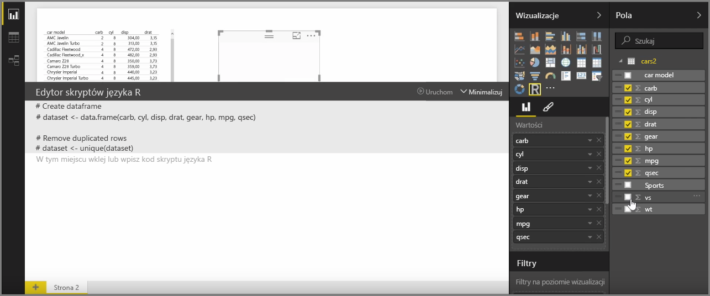
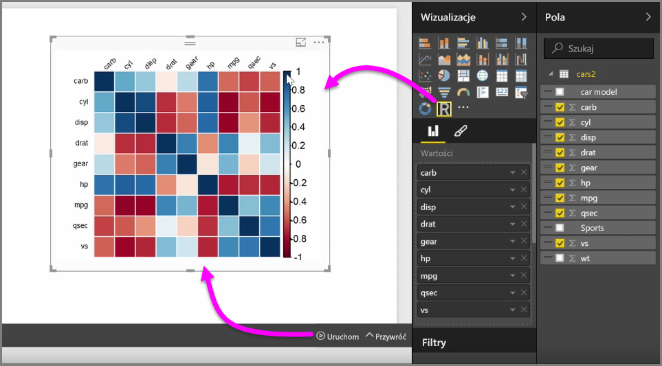
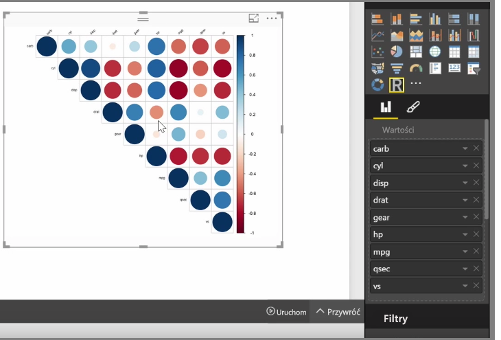
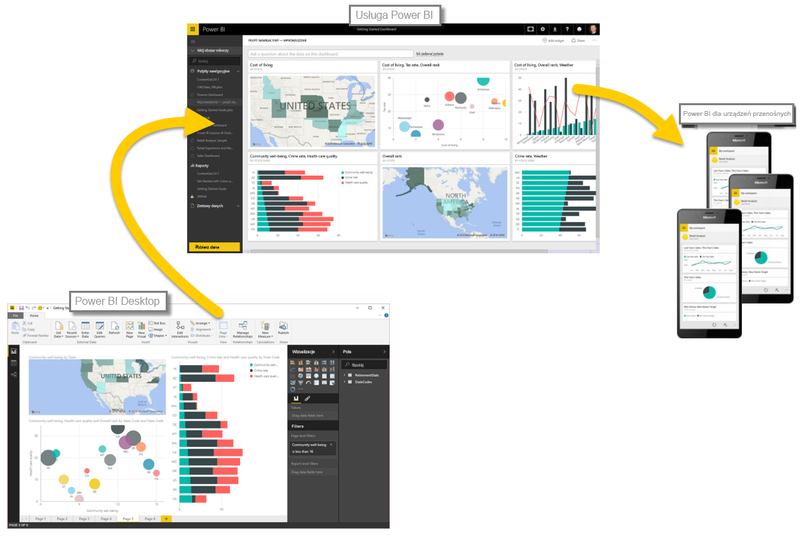

Za pomocą programu Power BI Desktop można wykonywać analizy statystyczne i tworzyć atrakcyjne wizualizacje dzięki integracji z językiem R. Wizualizacje tworzone w języku R można hostować w raporcie utworzonym w programie Power BI Desktop.

Po wybraniu ikony **Wizualizacja języka R** w okienku **Wizualizacje** usługa Power BI tworzy na kanwie symbol zastępczy na potrzeby hostowania wizualizacji języka R, a następnie wyświetla edytor skryptów języka R do użycia bezpośrednio na kanwie. Jeśli do wizualizacji języka R zostaną dodane pola, program Power BI Desktop dodaje je do okienka edytora skryptów języka R.

Poniżej kodu wygenerowanego przez usługę Power BI w edytorze skryptów języka R możesz rozpocząć pisanie własnego skryptu w języku R w celu wygenerowania wizualizacji. Po zakończeniu pisania skryptu wybierz pozycję **Uruchom**. Zostaną wykonane następujące zadania:

1. Dane dodane do wizualizacji (w okienku **Pola**) są wysyłane z programu Power BI Desktop do lokalnej instalacji języka R.
2. Skrypt utworzony w edytorze skryptów języka R w programie Power BI Desktop jest uruchamiany w tej lokalnej instalacji języka R.
3. Następnie program Power BI Desktop pobiera wizualizację z instalacji języka R i wyświetla go na kanwie.

Wszystkie te operacje są wykonywane bardzo szybko, a wynik jest wyświetlany w wizualizacji o nazwie **Wizualizacja języka R** na kanwie.

Wizualizację języka R można zmienić, dostosowując skrypt języka R, a następnie ponownie wybierając polecenie **Uruchom**. Na poniższym obrazie zmieniliśmy wizualizację, aby były na niej wyświetlane kółka zamiast kwadratów.

Wizualizacja języka R zachowuje się podobnie jak każda inna wizualizacja w programie Power BI Desktop, dzięki czemu można wchodzić z nią w interakcje, jak również łączyć ją z innymi wizualizacjami na kanwie. Podczas interakcji z innymi wizualizacjami na kanwie, takimi jak filtrowanie i wyróżnianie, wizualizacja języka R automatycznie reaguje podobnie jak wszystkie inne wizualizacje usługi Power BI, bez konieczności dostosowywania skryptu języka R.

Jest to dobry sposób, aby wykorzystać możliwości języka R bezpośrednio w programie Power BI Desktop.

## Następne kroki
**Gratulacje!** Część **Wizualizacje** kursu **Nauka z przewodnikiem** dotyczącego usługi Power BI została ukończona. Teraz masz dobrą orientację w wielu wizualizacjach oferowanych przez usługę Power BI oraz odpowiednią wiedzę na temat sposobu ich użycia, modyfikowania i dostosowywania. Wizualizacje z programu Power BI Desktop zasadniczo nie różnią się od wizualizacji z usługi Power BI, więc zdobyta wiedza ma zastosowanie do obu rodzajów wizualizacji.

Teraz możesz przejść do chmury i zacząć pracować w usłudze Power BI, gdzie można **eksplorować dane**. Jak wiesz, przepływ pracy wygląda podobnie do następującego:

* Umieszczenie danych w programie **Power BI Desktop** i utworzenie raportu.
* Opublikowanie danych w usłudze Power BI, w której można tworzyć nowe **wizualizacje** i pulpity nawigacyjne.
* **Udostępnienie** pulpitów nawigacyjnych innym użytkownikom — szczególnie tym, którzy pracują mobilnie.
* Wyświetlenie udostępnionych pulpitów nawigacyjnych i raportów oraz korzystanie z nich w aplikacjach **Power BI Mobile**.

Niezależnie od tego, czy tworzysz raporty, czy tylko je przeglądasz i z nich korzystasz, teraz już wiesz, jak te wizualizacje są tworzone i jak są połączone z danymi. W następnej części zobaczymy te wizualizacje i raporty w akcji.

Do zobaczenia w następnej sekcji!

