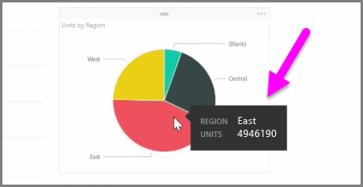

W tym artykule nauczysz się, jak tworzyć nowe wykresy słupkowe, wykresy kołowe i mapy drzewa oraz jak dostosowywać je do potrzeb Twoich raportów.

W programie Power BI Desktop istnieją dwa różne sposoby tworzenia nowej wizualizacji:

* Możesz przeciągnąć nazwy pól z okienka **Pola** i upuścić je na kanwie raportu. Domyślnie wizualizacja jest wyświetlana jako tabela danych.
  
  
* Możesz również kliknąć typ wizualizacji, którą chcesz utworzyć, w okienku **Wizualizacje**. W przypadku tej metody domyślna wizualizacja zawiera pusty symbol zastępczy, który przypomina wybrany typ wizualizacji.
  
  

Po utworzeniu grafu, mapy lub wykresu możesz rozpocząć przeciąganie pól danych do dolnej części okienka **Wizualizacje**, aby utworzyć i uporządkować wizualizację. Dostępne pola są różne w zależności od wybranego typu wizualizacji. W miarę przeciągania i upuszczania pól danych wizualizacja jest automatycznie aktualizowana w celu odzwierciedlenia zmian.

Możesz zmienić rozmiar wizualizacji, zaznaczając ją, a następnie przeciągając uchwyty do środka lub na zewnątrz. Możesz również przenieść wizualizację w dowolne miejsce na kanwie, klikając ją, a następnie przeciągając. Jeśli chcesz dokonać konwersji między różnymi typami wizualizacji, zaznacz wizualizację, którą chcesz zmienić, i po prostu wybierz inną wizualizację, używając ikon w okienku **Wizualizacje**. Usługa Power BI stara się przekonwertować wybrane pola na nowy typ wizualizacji w możliwie najlepszy sposób.

Gdy zatrzymujesz wskaźnik myszy na fragmencie wizualizacji, są wyświetlane etykietki narzędzi zawierające szczegóły dotyczące tego segmentu, takie jak etykiety i wartość całkowita.

Wybierz ikonę **Pędzel** w okienku **Wizualizacje**, aby dokonać kosmetycznych zmian wizualizacji, na przykład dostosować tło, tekst tytułu i kolory danych.

Dostępne opcje kosmetycznych zmian wizualizacji różnią się w zależności od wybranego typu wizualizacji.

