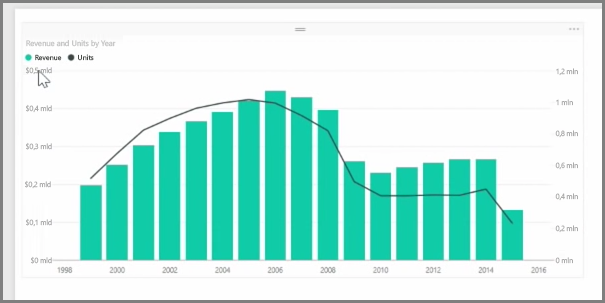
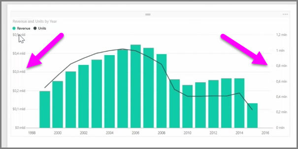
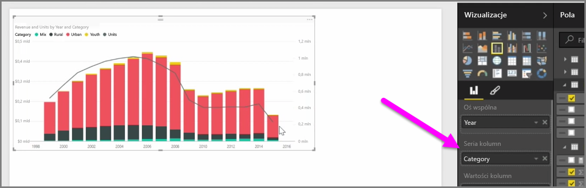

Gdy chcesz zwizualizować dwie miary o bardzo różnych skalach, takie jak przychód i jednostki, bardzo przydatny jest **wykres złożony** pokazujący wykres liniowy i wykres słupkowy na różnych skalach osi. Usługa Power BI obsługuje domyślnie wiele różnych typów wykresów złożonych, w tym popularne wykresy: **Liniowy** i **Skumulowany kolumnowy**.

Po utworzeniu wykresu złożonego jest wyświetlane pole **Oś udostępniona** (oś X), a następnie wartości Twoich dwóch pól, w tym przypadku kolumny i linii. Po obu stronach wizualizacji są wyświetlane dwie legendy osi Y.

Możesz również podzielić każdą kolumnę na kategorie, przeciągając kategorię do pola Seria kolumn w okienku Wizualizacje. Po wykonaniu tej czynności każdy słupek będzie proporcjonalnie pokolorowany na podstawie wartości w każdej kategorii.

Wykresy złożone są efektywnym sposobem wizualizacji w jednym miejscu wielu miar, które mają bardzo różne skale.

