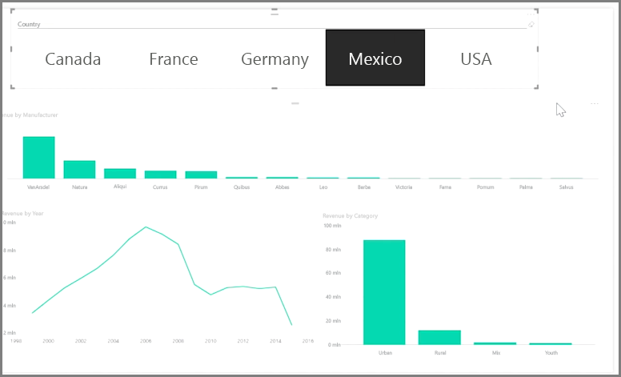

Fragmentatory są jednym z najbardziej zaawansowanych typów wizualizacji, szczególnie jako część raportu zajętości. **Fragmentator** to filtr wizualizacji na kanwie w programie **Power BI Desktop**, który umożliwia osobom oglądającym raport segmentowanie danych według określonej wartości, na przykład według roku lub lokalizacji geograficznej.

Aby dodać fragmentator do raportu, wybierz pozycję **Fragmentator** w okienku **Wizualizacje**.

Przeciągnij pole, za pomocą którego chcesz dokonać fragmentacji, i upuść je w górnej części symbolu zastępczego fragmentatora. Wizualizacja przekształci się w listę elementów z polami wyboru. Te elementy to filtry — zaznacz pole wyboru obok jednego z nich, aby przeprowadzić segmentację, a wszystkie pozostałe wizualizacje na tej samej stronie raportu zostaną przefiltrowane (lub *pofragmentowane*) zgodnie z zaznaczoną opcją.

Dostępnych jest kilka różnych opcji formatowania fragmentatora. Możesz ustawić go tak, aby akceptował wiele danych wejściowych jednocześnie, lub włączyć tryb **Wybór pojedynczego elementu**, aby w danym momencie używać jednego źródła danych. Możesz również dodać do elementów fragmentatora opcję **Zaznacz wszystko**, co jest przydatne, gdy masz szczególnie długą listę. Zmień orientację fragmentatora z domyślnej pionowej na poziomą. Dzięki temu stanie się on paskiem wyboru, a nie listą kontrolną.

