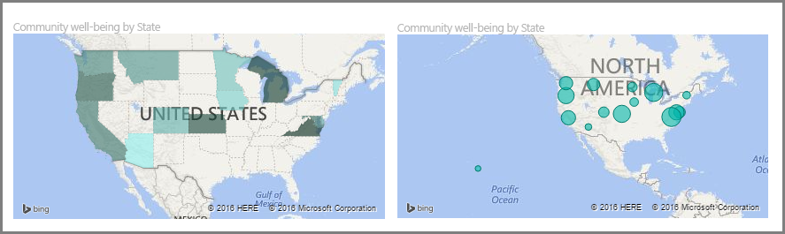
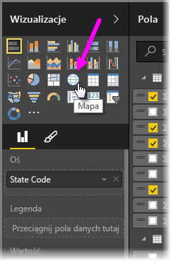
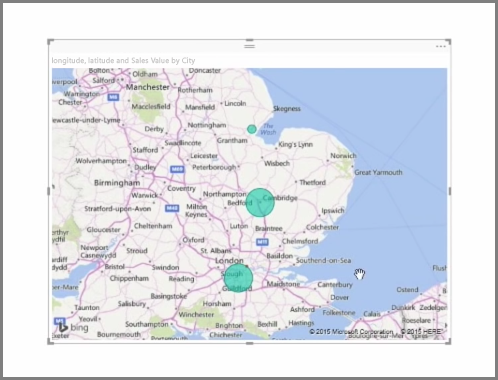
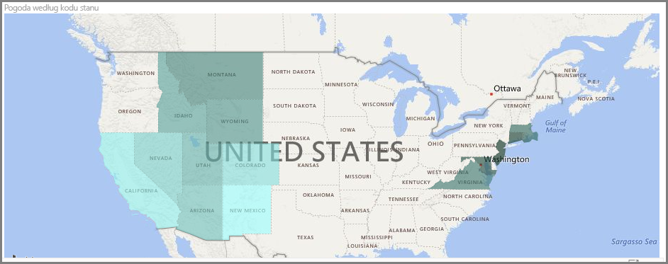
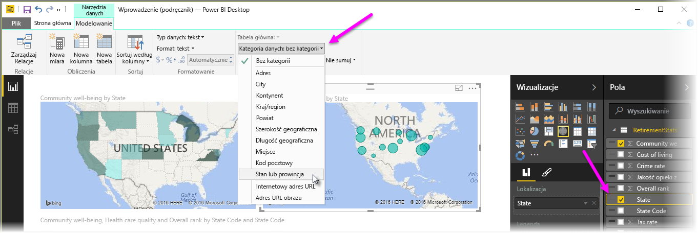

Usługa Power BI zawiera dwa różne typy wizualizacji w postaci map: mapę bąbelkową, która umieszcza bąbelek na punkcie geograficznym, i mapę w postaci kształtu, która faktycznie pokazuje kontur wizualizowanego obszaru.

> [!NOTE]
> Podczas pracy z krajami lub regionami używaj skrótów trzyliterowych, aby geokodowanie działało prawidłowo w wizualizacjach w postaci map. *Nie* używaj skrótów dwuliterowych, ponieważ niektóre kraje lub regiony mogą nie być prawidłowo rozpoznawane.
> Jeśli masz tylko skróty dwuliterowe, zapoznaj się z [tym zewnętrznym wpisem w blogu](https://blog.ailon.org/how-to-display-2-letter-country-data-on-a-power-bi-map-85fc738497d6#.yudauacxp), aby uzyskać informacje na temat kroków, które musisz wykonać w celu skojarzenia dwuliterowych skrótów krajów/regionów z trzyliterowymi skrótami krajów/regionów.
> 
> 

## Tworzenie map bąbelkowych
Aby utworzyć mapę bąbelkową, wybierz opcję **Mapa** w okienku **Wizualizacje**. Aby używać wizualizacji w postaci mapy, musisz dodać wartość do zasobnika *Lokalizacja* w opcjach **Wizualizacje**.

Usługa Power BI jest elastyczna, jeśli chodzi o zakres akceptowanych typów wartości lokalizacji — od ogólniejszych informacji, takich jak nazwa miejscowości lub kod lotniska, do bardzo szczegółowych danych współrzędnych geograficznych. Aby zmienić rozmiar bąbelka odpowiednio do poszczególnych lokalizacji na mapie, dodaj pole do zasobnika **Rozmiar**.

## Tworzenie map w postaci kształtu
Aby utworzyć mapę w postaci kształtu, wybierz opcję **Kartogram** w okienku Wizualizacje. Podobnie jak w przypadku map bąbelkowych, aby używać tej wizualizacji, musisz dodać pewną wartość do zasobnika Lokalizacja. Dodaj pole do zasobnika Rozmiar, aby odpowiednio zmienić intensywność koloru wypełnienia.

Ikona ostrzeżenia w lewym górnym rogu wizualizacji oznacza, że mapa wymaga większej ilości danych dotyczących lokalizacji, aby dokładnie wykreślić wartości. Jest to szczególnie powszechny problem, gdy dane w polu lokalizacji są niejednoznaczne, jak na przykład w przypadku użyciu nazwy obszaru *Waszyngton*, która może oznaczać stan lub okręg. Jedną z metod rozwiązania tego problemu jest zmiana nazwy kolumny na dokładniejszą, taką jak *Stan*. Innym rozwiązaniem jest ręczne zresetowanie kategorii danych przez wybranie pozycji **Kategoria danych** na karcie Modelowanie. W tym miejscu możesz przypisać kategorię do danych, na przykład „Stan” lub „Miasto”.

