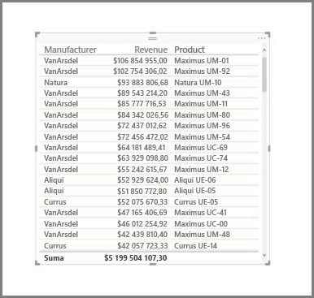

Oprócz licznych wykresów, program Power BI Desktop obsługuje również bardziej tabelaryczne wizualizacje. Tak naprawdę gdy przeciągasz pole kategorii lub pole tekstowe na kanwę raportu, domyślnie otrzymujesz tabelę wyników. Tabelę możesz przewijać w górę i w dół. Początkowo jest ona posortowana alfabetycznie.

Jeśli w tabeli znajdują się dane liczbowe, na przykład przychód, u dołu jest wyświetlana łączna suma. Poszczególne kolumny możesz sortować ręcznie, klikając ich nagłówki, aby przełączać kolejność na rosnącą lub malejącą. Jeśli kolumna nie jest dostatecznie szeroka, aby pomieścić całą jej zawartość, kliknij nagłówek i przeciągnij go w bok w celu poszerzenia kolumny.

Kolejność pól w zasobniku *Wartości* w okienku **Wizualizacje** określa kolejność ich wyświetlania w tabeli.

**Macierz** przypomina tabelę, ale ma inne nagłówki kategorii kolumn i wierszy. Podobnie jak w przypadku tabel, dane liczbowe są automatycznie sumowane u dołu i po prawej stronie macierzy.

W przypadku macierzy dostępnych jest wiele opcji kosmetycznych, takich jak automatyczna zmiana rozmiaru kolumn, przełączanie sum wierszy i kolumn, ustawianie kolorów itd. Podczas tworzenia macierzy upewnij się, że dane podzielone na kategorie (dane nieliczbowe) znajdują się po lewej stronie macierzy, a pliki liczbowe po prawej, aby został wyświetlony pasek przewijania w poziomie i aby przewijanie działało poprawnie.

