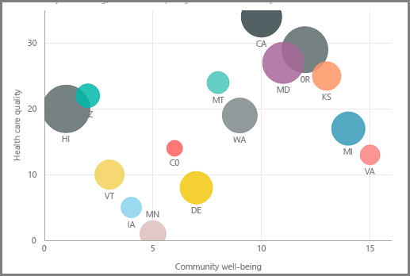
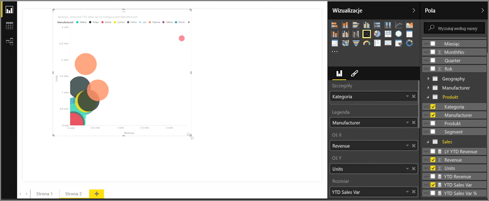
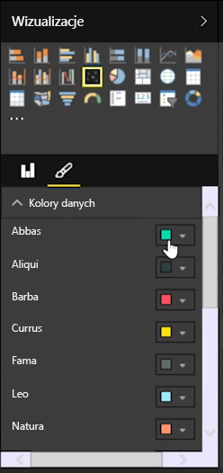
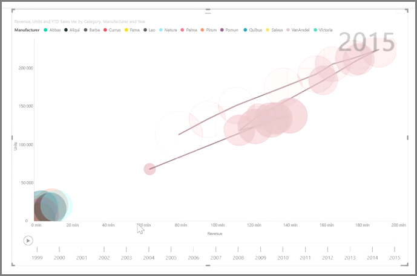

Jeśli chcesz porównać dwie różne miary, na przykład sprzedaż jednostkową względem przychodu, typową wizualizacją do użycia w tym przypadku jest wykres punktowy.

Aby utworzyć pusty wykres, wybierz pozycję **Wykres punktowy** w okienku **Wizualizacje**. Przeciągnij i upuść dwa pola, które chcesz porównać, z okienka **Pola** do zasobników opcji *Oś X* i *Oś Y*. W tym momencie wykres punktowy ma prawdopodobnie tylko mały bąbelek na środku wizualizacji — aby wskazać, jak chcesz segmentować dane, musisz dodać miarę do zasobnika *Szczegóły*. Na przykład jeśli porównujesz sprzedaż pozycji i przychód, być może chcesz podzielić dane według kategorii, producenta lub miesiąca sprzedaży.

Dodanie kolejnego pola do zasobnika *Legenda* powoduje oznaczenie bąbelków kolorami zgodnie z wartością pola. Możesz również dodać pole do zasobnika *Rozmiar*, aby zmienić rozmiar bąbelków zgodnie z tą wartością.

Wykresy punktowe mają również wiele opcji formatowania wizualizacji, takich jak włączanie konturu dla każdego pokolorowanego bąbelka i przełączanie poszczególnych etykiet. Kolory danych można również zmieniać w przypadku innych typów wykresów.

Dodając pole oparte na czasie do zasobnika *Oś odtwarzania*, możesz utworzyć animację zmian wykresu bąbelkowego w czasie. Kliknij bąbelek podczas animacji, aby zobaczyć ślad jego ścieżki.

>[!NOTE]
>Pamiętaj, że gdy widzisz tylko jeden bąbelek na wykresie punktowym, dzieje się tak dlatego, że usługa Power BI agreguje dane, co jest zachowaniem domyślnym. Aby uzyskać więcej bąbelków, dodaj kategorię do zasobnika *Szczegóły* w okienku **Wizualizacje**.
> 
> 

