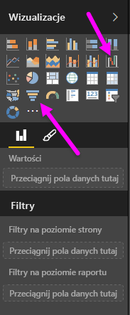
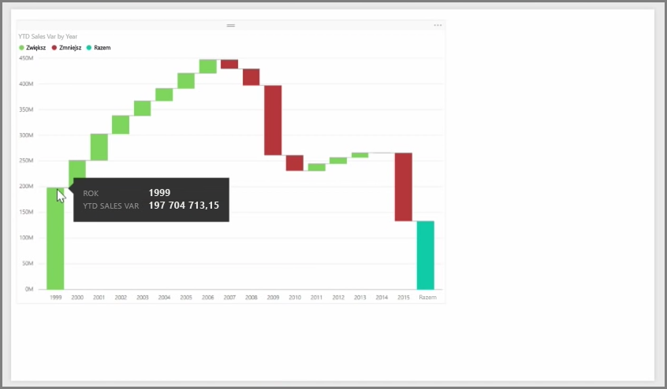
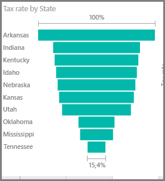

Wykres kaskadowy i wykres lejkowy to dwie dość interesujące (i prawdopodobnie niezbyt popularne) wizualizacje standardowe dostępne w usłudze Power BI. Aby utworzyć pusty wykres dowolnego typu, wybierz jego ikonę w okienku **Wizualizacje**.

**Wykresy kaskadowe** są zwykle używane do wyświetlania zmian określonej wartości w czasie.

Wykresy kaskadowe mają tylko dwie opcje zasobnika: *Kategoria* i *Oś Y*. Przeciągnij pole oparte na czasie, na przykład *rok* do zasobnika *Kategoria*, a wartość, którą chcesz śledzić, do zasobnika *Oś Y*. Okresy, w których nastąpił wzrost wartości, są domyślnie wyświetlane na zielono, natomiast okresy ze spadkiem wartości są wyświetlane na czerwono.

**Wykresy lejkowe** zazwyczaj są używane do pokazywania zmian w określonym procesie, takim jak potok sprzedaży lub starania związane z przechowywaniem witryny internetowej.

Wykres **kaskadowy** i **lejkowy** można pofragmentować i dostosować wizualnie.

