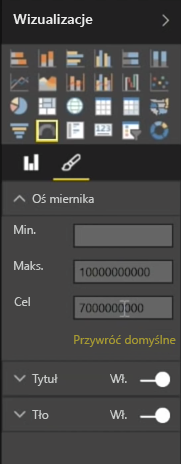

Na ogół wizualizacje służą do porównywania co najmniej dwóch różnych wartości. Jednak czasami podczas tworzenia raportów możesz potrzebować śledzenia tylko pojedynczego kluczowego wskaźnika wydajności (KPI) lub metryki w czasie. W programie Power BI Desktop możesz to zrobić, korzystając z wizualizacji w postaci karty **Wskaźnik** lub karty z **pojedynczą liczbą**. Aby utworzyć pusty wykres dowolnego typu, wybierz jego ikonę w okienku **Wizualizacje**.

Wskaźniki są szczególnie przydatne, gdy tworzysz pulpity nawigacyjne i chcesz wyświetlać postęp na drodze do określonego celu. Aby utworzyć wskaźnik, wybierz jego ikonę w okienku **Wizualizacje**, a następnie przeciągnij pole, które chcesz śledzić, do zasobnika *Wartość*.

Wskaźniki są wyświetlane domyślnie w rozmiarze 50% (lub dwa razy większym niż *Wartość*). To ustawienie można zmienić na dwa sposoby. Aby dynamicznie ustawić wartości, przeciągnij pola do zasobników wartości *Minimalna*, *Maksymalna* i *Docelowa*. Możesz również użyć opcji formatowania wizualizacji, aby ręcznie dostosować zakres wskaźnika.

Wizualizacje w postaci kart stanowią po prostu reprezentację liczbową pola. Domyślnie wizualizacje w postaci kart korzystają z jednostek wyświetlania, aby liczba była krótka. Na przykład wyświetlają „5 mld USD”, zamiast „5 000 000 000 USD”. Opcje formatowania wizualizacji umożliwiają zmianę lub całkowite wyłączenie używanej jednostki.

Jednym z ciekawszych zastosowań kart jest wyświetlanie niestandardowej miary, która została połączona z tekstem. Korzystając z poprzedniego przykładu, karta — oprócz niestandardowej miary — może zawierać zaawansowane funkcje języka DAX i wyświetlać coś w rodzaju „Łączny przychód w tym roku: 5 mld USD” lub „Postęp sprzedaży jednostkowej w tym roku:” i liczbę reprezentującą postęp.

