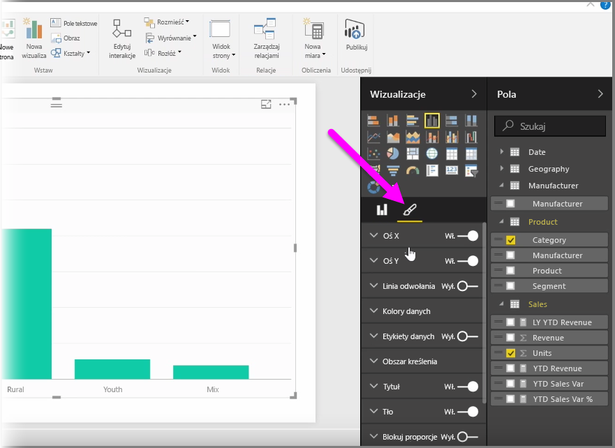

Istnieje wiele sytuacji, w których możesz potrzebować modyfikacji kolorów używanych na wykresach lub w wizualizacjach. Usługa Power BI zapewnia dużą kontrolę nad sposobem wyświetlania kolorów. Aby rozpocząć, wybierz wizualizację, a następnie w okienku **Wizualizacje** kliknij ikonę **Pędzel**.

Istnieje wiele opcji zmiany kolorów lub formatowania wizualizacji. Możesz zmienić kolor wszystkich pasków wizualizacji, wybierając selektor kolorów obok pozycji **Kolor domyślny**, a następnie wybierając odpowiedni kolor.

Możesz również zmienić kolor każdego paska (lub innego elementu, w zależności od wybranego typu wizualizacji), przełączając suwak **Pokaż wszystko** w położenie włączone. Po wykonaniu tej czynności dla każdego elementu zostanie wyświetlony selektor kolorów.

Możesz również zmienić kolor na podstawie wartości lub miary. W tym celu przeciągnij pole do zasobnika **Nasycenie koloru** w okienku Wizualizacje (pamiętaj, że ta opcja jest dostępna w sekcji **Źródło pola**, a nie w sekcji **Pędzel**).

Ponadto możesz zmienić skalę i kolory używane podczas wypełniania kolorami elementów danych. Możesz również wybrać skalę rozbieżności, przełączając suwak Rozbieżność w położenie włączone, co pozwala na korzystanie ze skali kolorów złożonej z trzech kolorów. Możesz również ustawić wartości *Minimalna*, *Środkowa* i *Maksymalna* wyświetlane na wykresie.

Za pomocą tych wartości możesz także tworzyć reguły, na przykład aby w przypadku wartości większych niż zero ustawić określony kolor, a w przypadku wartości mniejszych — inny kolor.

Innym przydatnym narzędziem umożliwiającym stosowanie kolorów jest ustawienie *linii stałej* nazywanej czasami również *linią odniesienia*. Możesz określić wartość linii stałej, ustawić jej kolor, a nawet dołączyć etykietę do linii odniesienia. Aby utworzyć linię stałą (i inne ciekawe linie), wybierz **okienko Analiza** (przypomina lupę), a następnie rozwiń sekcję **Linia odniesienia**.

Istnieje wiele innych linii, które możesz utworzyć w wizualizacji, znajdujących się również w **okienku Analiza**, na przykład Minimalna, Maksymalna, Średnia, Mediana i Percentyl.

Na koniec możesz utworzyć obramowanie wokół każdej wizualizacji i — podobnie jak w przypadku innych kontrolek — określić również kolor tego obramowania.

