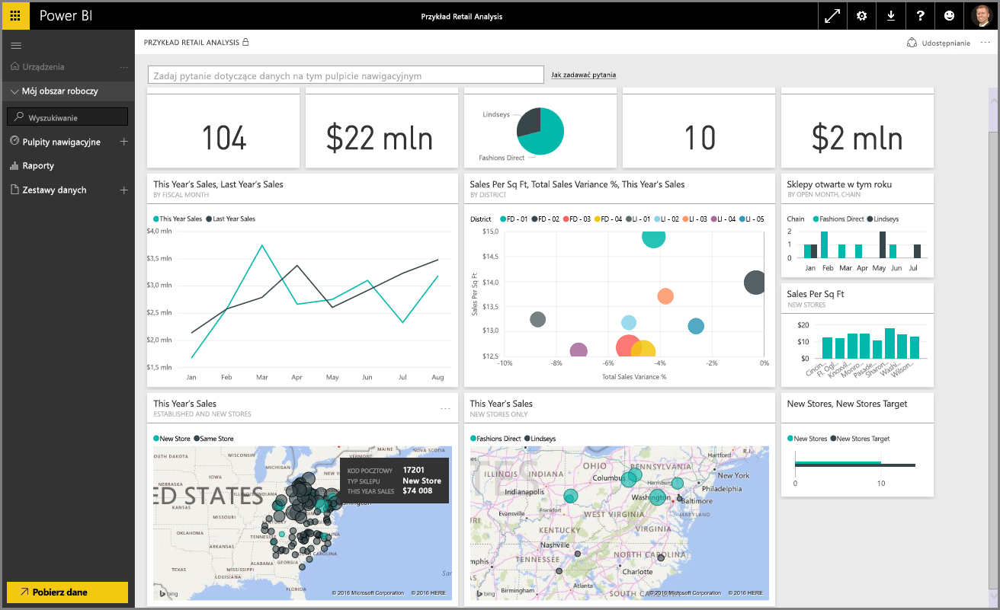

Witamy w części **Eksplorowanie danych** kursu **Nauka z przewodnikiem** dotyczącego usługi Power BI. Po poznaniu programu Power BI Desktop oraz zapoznaniu się ze sposobami pobierania i wizualizowania danych możesz zacząć eksplorować dane w usłudze Power BI.

W tej części nauczysz się wielu ciekawych rzeczy, wykonasz interesujące interakcje, a także zobaczysz, jak udostępniać dane w usłudze Power BI. Przygotuj się więc na angażujące i interesujące treści w tej części.

## Wprowadzenie do usługi Power BI
*Zobacz, co usługa Power BI ma do zaoferowania dla Twojej organizacji*

Usługa Power BI to naturalne rozszerzenie programu **Power BI Desktop**. Jego funkcje obejmują przekazywanie raportów, tworzenie pulpitów nawigacyjnych i zadawanie pytań dotyczących danych przy użyciu języka naturalnego. Ta usługa umożliwia ustawianie czasu odświeżania danych, udostępnianie danych w organizacji i tworzenie niestandardowych pakietów usług.

W następujących tematach zaprezentujemy usługę Power BI i pokażemy, jak przy jej użyciu można przekształcić dane analizy biznesowej w szczegółowe dane i umożliwiające współpracę środowisko decyzyjne.

