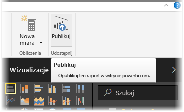
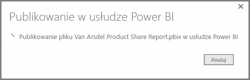
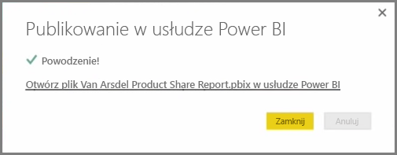
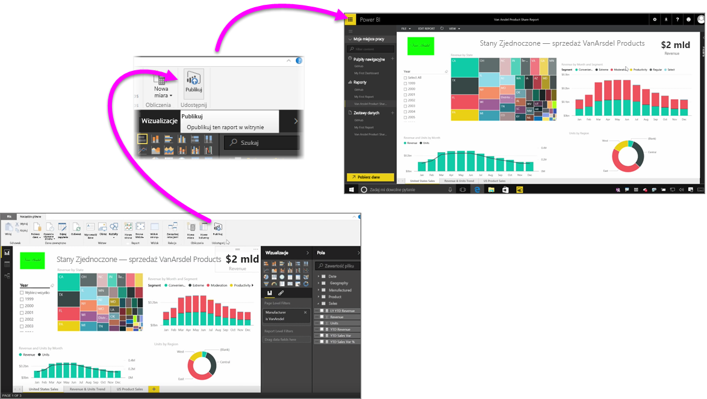

Publikowanie raportów w usłudze Power BI jest szybkie i łatwe.

Jeśli chcesz opublikować raport, po zakończeniu jego tworzenia w programie **Power BI Desktop** po prostu wybierz przycisk **Publikuj** znajdujący się na karcie **Narzędzia główne**.

Raport i dane, w tym wizualizacje, zapytania i niestandardowe miary są pakowane razem i przekazywane do usługi Power BI.

> [!NOTE]
> Raporty tworzone w programie Power BI Desktop są często nazywane plikami **pbix**, ponieważ takie rozszerzenie mają one w systemie Windows.
> 

Po zakończeniu przekazywania pojawia się okno dialogowe z informacją o pomyślnym ukończeniu procesu publikowania i z linkiem prowadzącym bezpośrednio do raportu w usłudze Power BI wyświetlanego w przeglądarce internetowej.

I to wszystko. Publikowanie raportów z programu Power BI Desktop w usłudze Power BI jest proste.

