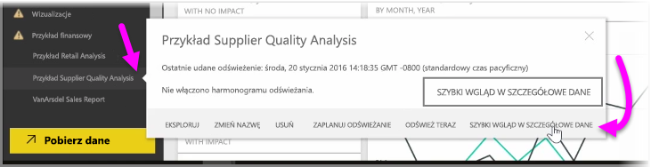
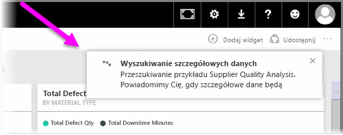
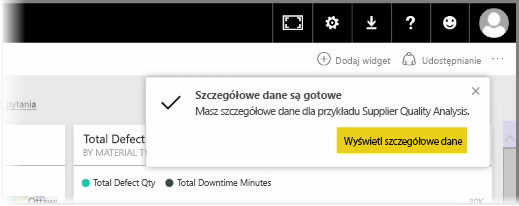
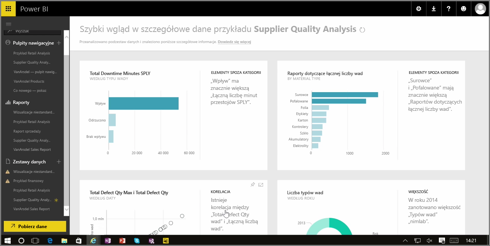

Podczas pracy z pulpitem nawigacyjnym, raportem lub zestawem danych w usłudze Power BI możesz skorzystać z oferowanej przez tę usługę możliwości szybkiego wglądu w szczegółowe dane. W usłudze Power BI w sekcji **Zestawy danych** w okienku po lewej stronie wybierz *wielokropek* (trzy kropki) obok interesującego Cię zestawu danych. Zostanie wyświetlone menu opcji i po prawej stronie zobaczysz opcję o nazwie **Szybki wgląd w szczegółowe dane**.

Po wybraniu opcji Szybki wgląd w szczegółowe dane usługa Power BI wykonuje niektóre operacje uczenia maszynowego, wyszukuje dane i analizuje je w celu znalezienia szczegółowych danych. W prawym górnym rogu okna usługi zobaczysz powiadomienie wskazujące, że usługa Power BI wyszukuje szczegółowe dane.

Po około piętnastu sekundach powiadomienie zmieni się na informację, że usługa Power BI odnalazła niektóre szczegółowe dane.

Po wybraniu przycisku **Wyświetl szczegółowe dane** na powiadomieniu zostanie wyświetlona strona z wizualizacjami zawierającymi szczegółowe dane znalezione przez usługę Power BI. Będzie to wyglądało podobnie jak na następującym obrazie. Zbiór znalezionych szczegółowych danych można przewijać na stronie, wyświetlać i analizować.

Podobnie jak w przypadku wszystkich innych wizualizacji, na stronie Szybki wgląd w szczegółowe dane można wchodzić w interakcje z wizualizacjami, przypinać je do pulpitu nawigacyjnego (jeśli istnieje) oraz przeprowadzić ich dalsze filtrowanie (dowolną ich liczbę) w celu znalezienia dodatkowych wizualizacji, które mogą mieć dla Ciebie znaczenie.

Korzystając ze strony **Szybki wgląd w szczegółowe dane** usługi Power BI, można znaleźć elementy odstające i trendy w danych, a następnie użyć tych elementów na pulpitach nawigacyjnych lub dodatkowo je doprecyzować i przefiltrować, aby wyodrębnić szczegółowe dane, które mają dla Ciebie największe znaczenie.

