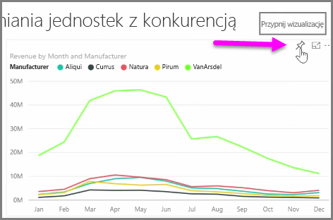

**Pulpity nawigacyjne** w usłudze Power BI to jednostronicowe kolekcje wizualizacji tworzone z poziomu usługi Power BI. Pulpity nawigacyjne są tworzone przez **przypinanie** wizualizacji z raportów utworzonych i opublikowanych przy użyciu programu Power BI Desktop lub wizualizacji utworzonych z poziomu samej usługi Power BI. **Przypinanie** wizualizacji do pulpitu nawigacyjnego jest bardzo podobne do przypinania zdjęcia do tablicy korkowej na ścianie — wizualizacja jest umieszczana w wybranym miejscu, aby mogły obejrzeć ją inne osoby. Aby przypiąć wizualizację, otwórz jej raport w usłudze Power BI. Najedź kursorem na wizualizację do przypięcia i wybierz ikonę **pinezki**.

Pojawi się okno dialogowe, w którym możesz wybrać pulpit nawigacyjny wizualizacji z menu rozwijanego lub utworzyć nowy pulpit nawigacyjny. Możesz również wyświetlić podgląd wizualizacji przypiętej na pulpicie nawigacyjnym. Wizualizacje z wielu raportów i stron można przypiąć do pojedynczego pulpitu nawigacyjnego, co pozwoli na łączenie różnych zestawów danych i źródeł w ramach pojedynczej strony szczegółowych informacji.

W obszarze **Pulpity nawigacyjne** można dodawać dowolny rodzaj wizualizacji, w tym wykresy, mapy, obrazy i kształty, „przypinając” je. Wizualizacja przypięta do pulpitu nawigacyjnego jest nazywana **kafelkiem**.

Pulpity nawigacyjne użytkownika, w tym wszelkie nowe, są wyświetlane w sekcji Pulpity nawigacyjne po lewej stronie okna usługi Power BI. Wybierz pulpit nawigacyjny z listy, aby go wyświetlić.

Układ wizualizacji na pulpicie nawigacyjnym można zmienić w dowolny sposób. Aby zmienić rozmiar kafelka, przeciągnij uchwyty do środka lub na zewnątrz. Aby przenieść kafelek, po prostu kliknij i przeciągnij go do innej lokalizacji na pulpicie nawigacyjnym. Umieść kursor na kafelku, a następnie kliknij ikonę **ołówka**, aby otworzyć obszar **Szczegóły kafelka**, w którym można zmienić wartość pola **Tytuł** lub **Podtytuł**.

Kliknij kafelek pulpitu nawigacyjnego, aby wyświetlić raport, z którego pochodzi. Umożliwi to szybkie wyświetlenie odpowiednich danych pod wizualizacją. Możesz również zmienić ten link, korzystając z pola **Ustaw link niestandardowy** w obszarze **Szczegóły kafelka**.

Kafelki z jednego pulpitu nawigacyjnego można przypiąć do innego, jeśli na przykład masz kolekcję pulpitów nawigacyjnych i chcesz utworzyć pulpit zbiorczy. Proces jest taki sam: umieść kursor na kafelku i wybierz **ikonę pinezki**. Pulpity nawigacyjne można łatwo tworzyć i zmieniać. Można również dostosowywać je w celu uzyskania żądanego wyglądu jednostronicowego pulpitu nawigacyjnego.

