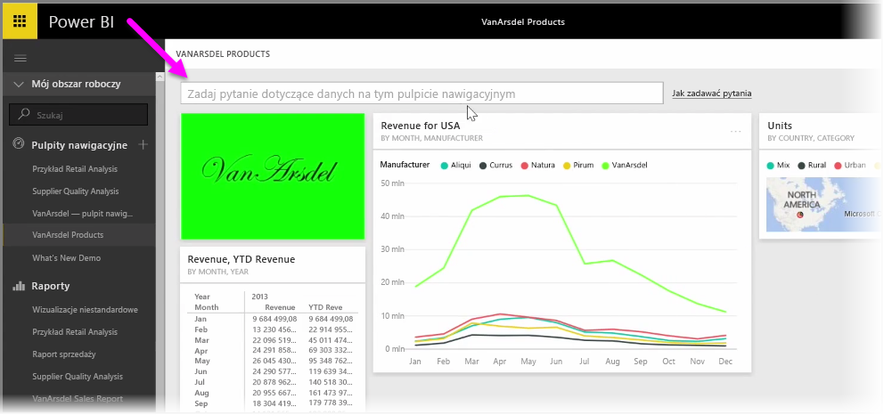

Usługa Power BI oferuje zaawansowany aparat rozpoznawania języka, który umożliwia zadawanie pytań o dane przy użyciu pytań i fraz konwersacyjnych. Dlatego, oprócz kompilowania raportów i wizualizacji, przy użyciu usługi Power BI można również tworzyć wykresy i schematy, po prostu zadając proste pytania.

Aby zadać pytanie dotyczące danych, otwórz pulpit nawigacyjny w usłudze Power BI. W górnej części ekranu pojawi się pole wejściowe, w którym można zadać pytanie o wyświetlone dane. Ta funkcja jest czasami nazywana *Pytania i odpowiedzi* (w języku angielskim jeszcze częściej używana jest nazwa **Q&A**).

Po kliknięciu w polu usługa Power BI wyświetla na podstawie podanych danych monity z niektórym proponowanymi terminami, takimi jak „Przychody od początku roku”. Możesz kliknąć proponowany termin, aby zobaczyć wynik — często wyświetlany jako prosta tabela lub karta. Po wybraniu jednej z proponowanych fraz usługa Power BI automatycznie tworzy w czasie rzeczywistym wizualizację opartą na wybranej opcji.

Można również zadawać pytania przy użyciu języka naturalnego, na przykład „Jaki był nasz przychód w ostatnim roku?” lub „Jakie produkty miały najwyższą sprzedaż w marcu 2014?”. Usługa Power BI wyświetla własną interpretację pytania i wybiera najlepszy typ wizualizacji reprezentującej odpowiedź. I tak samo jak w przypadku innych wizualizacji w usłudze Power BI możesz **przypiąć** ją do wybranego pulpitu nawigacyjnego, wybierając ikonę **pinezki**.

W dowolnym momencie można edytować wizualizację utworzoną przez pytanie lub frazę w języku naturalnym. Wystarczy użyć okienek **Wizualizacje** i **Pola** po prawej stronie ekranu. Podobnie jak w przypadku innych wizualizacji w usłudze Power BI, można zmieniać układ, dostosowywać filtry i zmieniać dane wejściowe pól.

Aby zapisać idealną wizualizację na pulpicie nawigacyjnym, wystarczy wybrać ikonę **pinezki** obok pola wejściowego pytania.

