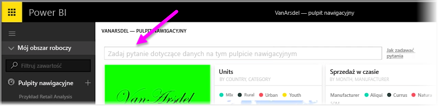

Usługa Power BI umożliwia dodawanie sugerowanych pytań do innych użytkowników, którzy używają pola zapytania w języku naturalnym dla pulpitu nawigacyjnego (często nazywanego polem **pytań i odpowiedzi**). Te sugerowane pytania użytkownicy widzą po kliknięciu pola wprowadzania w górnej części pulpitu nawigacyjnego.

Aby dodać własne pytania, wybierz wielokropek (trzy kropki, ...) obok nazwy pulpitu nawigacyjnego do użycia, a następnie wybierz pozycję **Ustawienia** z menu.

 Spowoduje to otwarcie strony **Ustawienia** dla pulpitu nawigacyjnego i odpowiednich zestawów danych lub skoroszytów. Możesz całkowicie wyłączyć pole wejściowe wyszukiwania typu Pytania i odpowiedzi z sekcji **Pulpity nawigacyjne** strony **Ustawienia**, ale chcemy dodać pytania, dlatego wybieramy sekcję **Zestawy danych**.

W sekcji **Zestawy danych** są wyświetlane wszystkie zestawy danych skojarzone z pulpitem nawigacyjnym. Z listy wybierz zestaw danych skojarzony z pulpitem nawigacyjnym, wybierz pozycję **Proponowane pytania** (funkcja pytań i odpowiedzi), a następnie wybierz link **Dodaj pytanie**. Wprowadź pytanie lub monit w polu wejściowym i wybierz pozycję **Zastosuj**.

Teraz za każdym razem, gdy ktoś kliknie pole wejściowe wyszukiwania na wybranym pulpicie nawigacyjnym, zobaczy sugerowane wpisy w górnej części listy monitów. Kliknięcie danego spowoduje przejście do odpowiedzi w sekcji pytań i odpowiedzi. Jest to wartościowy sposób zachęcenia użytkowników pulpitu nawigacyjnego do zastanowienia się nad dostępnymi typami danych oraz najlepszą metodą ich użycia.

