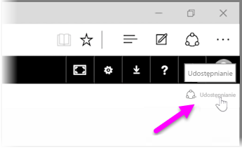
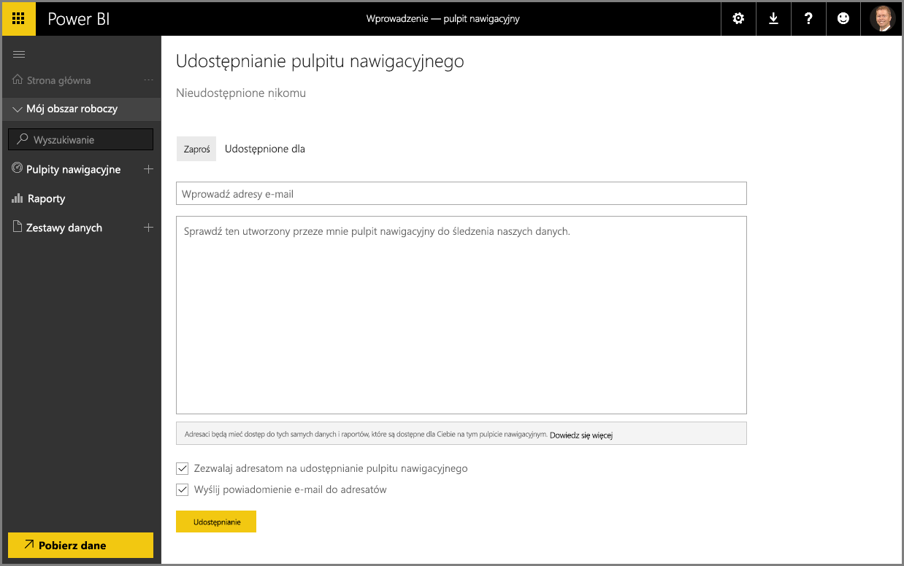

Widzieliśmy już, jak usługa Power BI pomaga wyszukiwać dane, gromadzić je w modelu danych oraz kompilować raporty i wizualizacje przy użyciu tych danych. Zobaczyliśmy także, jak można publikować te raporty w usłudze Power BI i tworzyć pulpity nawigacyjne pomocne podczas monitorowania informacji w czasie. Wszystkie te funkcje są jeszcze bardziej wydajne, gdy udostępniasz szczegółowe informacje innym osobom w organizacji. Na szczęście udostępnianie pulpitów nawigacyjnych jest proste.

Aby udostępnić pulpit nawigacyjny, otwórz go w usłudze Power BI, a następnie wybierz link **Udostępnij** w prawym górnym rogu.

Zostanie wyświetlona strona **Udostępnianie pulpitu nawigacyjnego**, na której można wybrać sekcję **Zaproszenie**, a następnie wypełnić pole wejściowe **Adres e-mail** danymi osób, którym chcesz udzielić dostępu do pulpitu nawigacyjnego. Usługa Power BI porównuje wpisywane adresy e-mail z kontami w Twojej domenie i domenie usługi Office 365, a następnie uzupełnia je automatycznie, gdy jest to możliwe. Możesz również kopiować i wklejać adresy e-mail w tym polu lub używać listy dystrybucyjnej, grupy zabezpieczeń lub grupy usługi Office 365, aby jednocześnie nawiązać kontakt z wieloma osobami.

Jeśli zaznaczono pole wyboru (u dołu) w celu *wysyłania powiadomienia e-mail do adresatów*, adresaci będą otrzymywać wiadomości e-mail z informacją o udostępnieniu im Twojego pulpitu nawigacyjnego, w tym linku do pulpitu nawigacyjnego. Możesz dodać notatkę do otrzymywanej wiadomości e-mail lub wysłać notatkę utworzoną w usłudze Power BI (znajduje się ona w polu bezpośrednio pod wprowadzonymi adresami e-mail).

>[!NOTE]
>Adresaci bez istniejącego konta usługi Power BI zostaną przed wyświetleniem pulpitu nawigacyjnego przeprowadzeni przez proces tworzenia nowego konta.
> 
> 

Każdy użytkownik, któremu udostępnisz pulpit nawigacyjny, będzie go widzieć i korzystać z niego w taki sam sposób jak Ty. Jednak osoby te będą mieć dostęp *tylko do odczytu* do podstawowych raportów i *nie będą mieć dostępu* do podstawowych zestawów danych.

Możesz również wybrać kartę **Udostępniono** na stronie Udostępnianie pulpitu nawigacyjnego, aby wyświetlić osoby, którym wcześniej udostępniono ten pulpit nawigacyjny.

