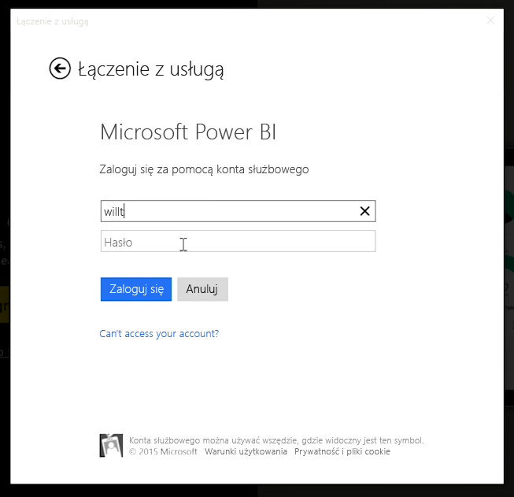
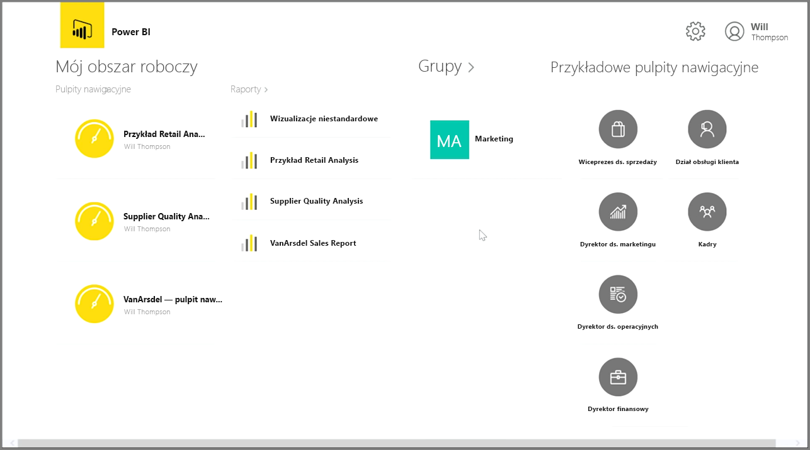
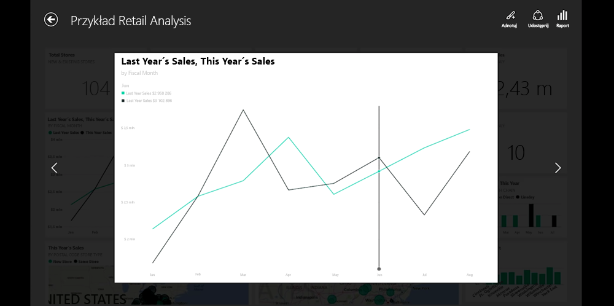
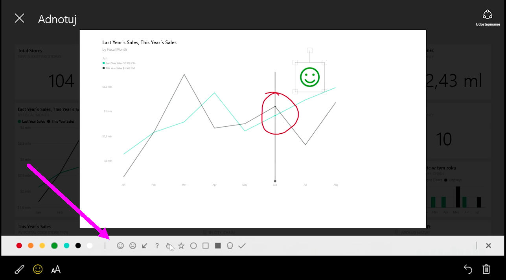

Jeśli chcesz śledzić dane podczas podróży, możesz użyć jednej z aplikacji mobilnych usługi Power BI dla urządzeń z systemem iOS, Android i Windows.

W przypadku korzystania z aplikacji Power BI najpierw zaloguj się do swojego konta przy użyciu informacji o koncie usługi Power BI. Na urządzeniu przenośnym z systemem Windows (w tym przypadku tablecie) logowanie wygląda podobnie jak poniżej.

Na pierwszym wyświetlonym ekranie widać całą zawartość, do której masz dostęp, w tym raporty, pulpity nawigacyjne i grupy. Istnieją także przykładowe pulpity nawigacyjne, których można użyć jako inspiracji lub w celu zapoznania się z możliwościami usługi Power BI. Aplikacja została zaprojektowana do obsługi dotykiem: dotknij pulpitu nawigacyjnego lub raportu, aby wyświetlić go na pełnym ekranie, a następnie przewijaj go przy użyciu palca.

Dowolne pulpity nawigacyjne można otwierać, dotykając ich. Na pulpicie nawigacyjnym można dotknąć kafelka, aby ustawić dla niego tryb koncentracji uwagi w większym widoku.

Można również dodawać adnotacje do odnalezionych informacji szczegółowych, wybierając przycisk **Adnotuj** w prawym górnym rogu. Umożliwi to rysowanie w pliku z trybem koncentracji uwagi w celu wyróżnienia poszczególnych obszarów zainteresowania. Narzędzia adnotacji można znaleźć wzdłuż dolnej części ekranu.

Udostępniaj kafelek z adnotacjami, wybierając link **Udostępnij** w prawym górnym rogu.

Wybierz link **Raport** w prawym górnym rogu, aby wyświetlić odpowiedni raport dotyczący kafelka. Spowoduje to wyświetlenie dokładnie tych samych wizualizacji, które można zobaczyć w przeglądarce internetowej lub w programie Power BI Desktop. Będzie można również wchodzić w interakcje z raportem przez wybieranie pasków, przechodzenie do szczegółów i używanie fragmentatorów.

