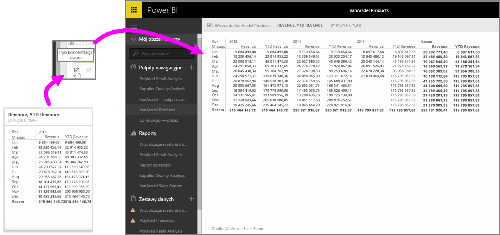

Jeśli przeglądasz pulpity nawigacyjne lub raporty w usłudze Power BI, czasami użyteczne może okazać się skoncentrowanie na danym wykresie lub wizualizacji. Możesz to zrobić na dwa sposoby.

Jeśli jesteś na pulpicie nawigacyjnym, najedź kursorem na kafelek, aby wyświetlić kilka innych opcji ikon w prawym górnym rogu. Po wybraniu wielokropka (trzech kropek) zostanie wyświetlona kolekcja ikon reprezentujących akcje, które można wykonać na kafelku.

Pierwsza ikona z lewej strony ma etykietę **Tryb koncentracji uwagi**. Wybierz tę ikonę, aby rozwinąć kafelek w celu objęcia pełnego pulpitu nawigacyjnego.

**Tryb koncentracji uwagi** umożliwia Ci zobaczenie znacznie większej liczby szczegółów w wizualizacjach i legendach. Na przykład w przypadku zmiany rozmiaru kafelka w usłudze Power BI niektóre kolumny mogą nie być wyświetlane ze względu na miejsce dostępne na kafelku.

W **trybie koncentracji uwagi** możesz zobaczyć wszystkie dane. Możesz również przypiąć wizualizację bezpośrednio z trybu koncentracji uwagi na innym pulpicie nawigacyjnym, wybierając ikonę **pinezki**. Aby zamknąć **tryb koncentracji uwagi**, wybierz ikonę **Wstecz do...** w lewym górnym rogu **trybu koncentracji uwagi**.

Proces jest podobny w przypadku przeglądania raportu. Najedź kursorem na wizualizację, aby wyświetlić trzy ikony w prawym górnym rogu, i wybierz ikonę **Tryb koncentracji uwagi**. Wybranie tej ikony powoduje rozszerzenie wizualizacji w celu objęcia pełnej kanwy raportu. W tym trybie wizualizacja nadal działa interaktywnie, ale możesz tymczasowo utracić efekty dla wielu filtrów między wizualizacjami.

Najedź kursorem na rozwinięty kafelek lub raport i wybierz lewą ikonę z daszkiem **Wstecz do...** w lewym górnym rogu, aby wrócić do poprzedniego widoku.

