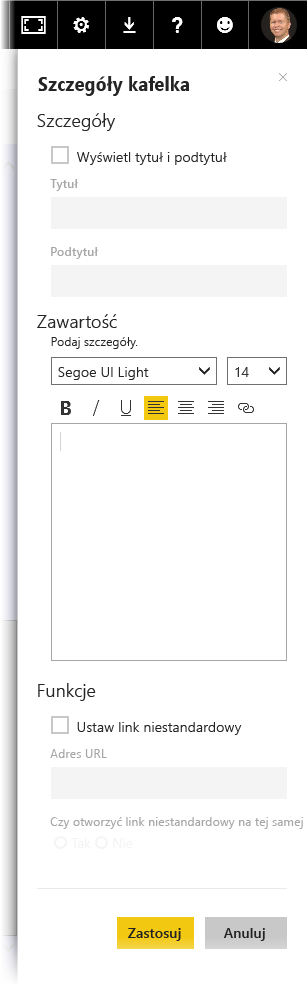

Po skompilowaniu pulpitu nawigacyjnego można edytować jego **kafelki* w usłudze Power BI, aby zmienić formatowanie.

Aby wprowadzić zmiany kafelka, najedź kursorem na kafelek, a następnie wybierz wielokropek (trzy kropki), aby wyświetlić kolekcję ikon, które umożliwią wprowadzenie wybranych zmian.

Wybierz ikonę **pióra**, aby otworzyć okienko **Szczegóły kafelka**. W tym miejscu możesz zmienić wartości **Tytuł** i **Podtytuł** dla kafelka, dodać datę i godzinę jego ostatniego odświeżenia oraz uwzględnić inne szczegóły, takie jak utworzony link niestandardowy.

Domyślnie po kliknięciu kafelka pulpitu nawigacyjnego nastąpi przejście do źródłowego raportu. Aby zmienić to zachowanie, użyj pola **Ustaw link niestandardowy** w okienku **Szczegóły kafelka**. Jeden z popularnych sposobów używania tej funkcji to przeniesienie użytkowników do strony głównej organizacji po kliknięciu obrazu logo.

## Dodawanie widgetów do pulpitu nawigacyjnego
Możesz również dodawać widgety do pulpitu nawigacyjnego. **Widget** to specjalny kafelek pulpitu nawigacyjnego, który zamiast wizualizacji zawiera inne elementy, takie jak obraz, wideo online, pole tekstowe lub sformatowana zawartość internetowa.

Po wybraniu linka Dodaj widget w prawym górnym rogu pulpitu nawigacyjnego zostanie wyświetlone okno dialogowe **Dodawanie widgetu**.

Po dodaniu na przykład pola tekstowego po prawej stronie pojawi się okienko **Szczegóły kafelka**, w którym można edytować szczegóły podobnie jak w przypadku edytowania szczegółów dowolnego kafelka. W przypadku widgetów istnieje również sekcja umożliwiająca definiowanie lub modyfikowanie zawartości widgetu, takiej jak edytor tekstu sformatowanego dla pola tekstowego.

Dzięki widgetom i możliwości edytowania szczegółów możesz dostosowywać pulpit nawigacyjny tak, aby wyglądał dokładnie tak, jak chcesz.

