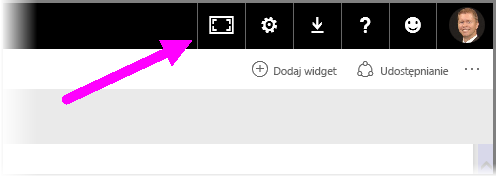
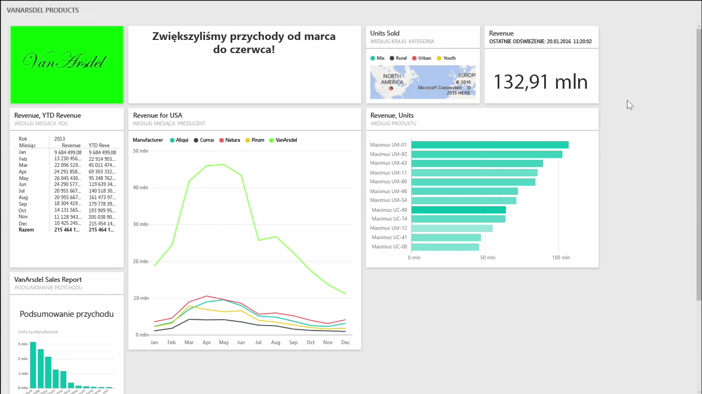
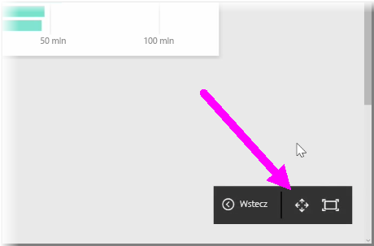
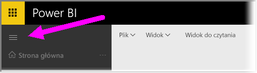

Może się okazać, że od czasu do czasu podczas tworzenia pulpitów nawigacyjnych masz więcej zawartości niż można zmieścić na kanwie. Istnieje kilka rozwiązań, które ułatwiają zarządzanie sposobem wyświetlania pulpitu nawigacyjnego w celu uzyskania pełnego widoku zawartości pulpitu nawigacyjnego.

Najprostsza metoda wyświetlenia całego pulpitu nawigacyjnego na jednym ekranie to wybranie przycisku **Tryb pełnoekranowy** w prawym górnym rogu pulpitu nawigacyjnego.

Wybranie przycisku **Tryb pełnoekranowy** spowoduje przejście przeglądarki do trybu pełnoekranowego, usunięcie wszystkich elementów wykończeniowych z pulpitu nawigacyjnego i zwiększenie w ten sposób ilości miejsca możliwego do przeglądania.

Z poziomu **trybu pełnoekranowego** można wybrać opcję **Dopasuj do ekranu**, aby zmniejszyć wszystkie swoje kafelki tak, aby zmieściły się na jednym ekranie, bez konieczności używania pasków przewijania. Ten tryb jest często nazywany *trybem telewizyjnym* i ułatwia prowadzenie prezentacji za pomocą pulpitów nawigacyjnych lub wyświetlanie pulpitu nawigacyjnego na monitorach korytarzowych.

Innym sposobem zarządzania miejscem na pulpicie nawigacyjnym jest zwijanie okienka nawigacji z lewej części strony przez wybranie ikony z trzema poziomymi kreskami. Aby rozwinąć okienko nawigacji, kliknij ikonę ponownie.

Aby zagwarantować, że pulpit nawigacyjny zawsze będzie mieć zwinięty pasek nawigacji, możesz dodać następujący ciąg na końcu adresu URL:

> ?collapseNavigation=true
> 
> 

Użytkownicy, którzy wybiorą ten link, zobaczą otwarty pulpit nawigacyjny ze zwiniętym paskiem nawigacji.

