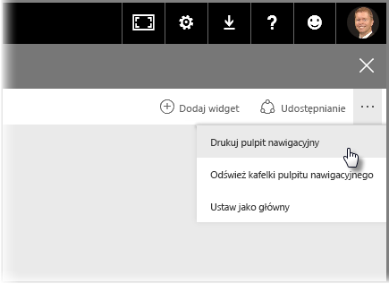
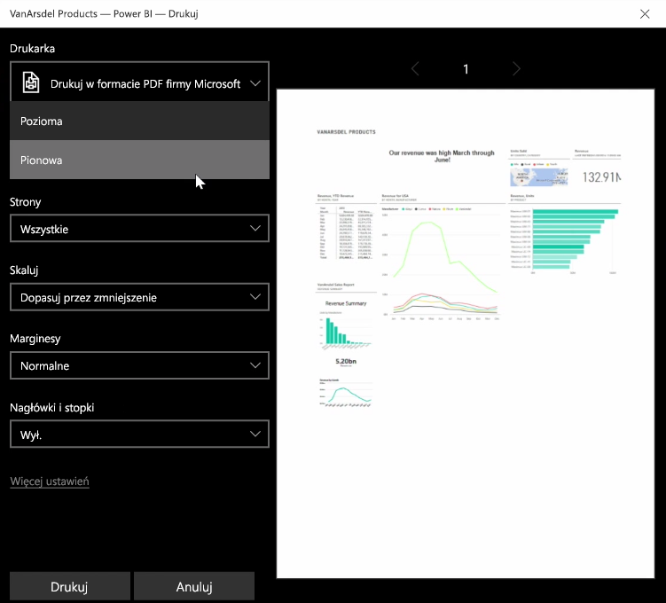
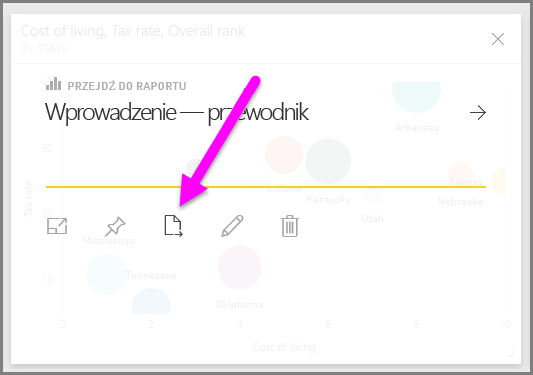
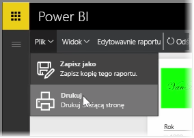

Czasami musisz przynieść wydrukowany raport lub pulpit nawigacyjny na spotkanie albo chcesz udostępnić go innym osobom. Dzięki usłudze Power BI możesz przez parę dni wykonywać wydruki wizualizacji.

W usłudze Power BI wybierz wielokropek (trzy kropki) w prawym górnym rogu strony usługi, a następnie wybierz pozycję **Drukuj pulpit nawigacyjny**.

Zostanie wyświetlone okno dialogowe **Drukowanie** umożliwiające wybranie drukarki, do której chcesz wysłać pulpit nawigacyjny, a także standardowych opcji drukowania, takich jak orientacja *pionowa* lub *pozioma*.

## Eksportowanie danych z wizualizacji
Możesz również wyeksportować dane z dowolnej wizualizacji w usłudze Power BI. Wystarczy wybrać wielokropek w dowolnej wizualizacji, a następnie wybrać przycisk **Eksportuj dane** (środkowy przycisk). Spowoduje to utworzenie pliku CSV i pobranie go na komputer lokalny oraz wyświetlenie w przeglądarce komunikatu o ukończeniu pobierania (tak jak w przypadku każdego innego pobierania inicjowanego w przeglądarce).

Możesz również wydrukować lub wyeksportować dane bezpośrednio z raportu. Podczas przeglądania raportu w usłudze Power BI wybierz kolejno pozycje **Plik > Drukuj**, aby otworzyć okno dialogowe.

I tak jak w przypadku pulpitu nawigacyjnego możesz także eksportować dane z wizualizacji, wybierając w niej przycisk eksportowania.

