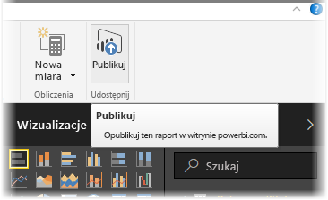
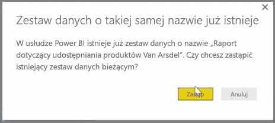
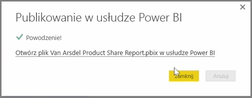

Raporty i zestawy danych już opublikowane z poziomu programu Power BI Desktop do usługi Power BI można aktualizować. W tym celu wybierz pozycję **Publikuj** na karcie wstążki **Narzędzia główne**.

W przypadku publikowania raportu, który już istnieje w usłudze Power BI, jest wyświetlany monit o potwierdzenie chęci zastąpienia poprzedniego zestawu danych i raportów edytowaną wersją właśnie wybraną do zaktualizowania.

Jeśli wybierzesz pozycję **Zastąp**, zestawy danych i raporty w usłudze Power BI zostaną zastąpione zestawami danych i raportami w najnowszej wersji programu Power BI Desktop dla pliku.

I tak samo jak podczas każdego innego zdarzenia **publikowania** z poziomu programu Power BI Desktop wyświetlane jest okno dialogowe informujące o pomyślnym ukończeniu zdarzenia publikowania. Dostępny jest także link do raportu w usłudze Power BI.

W ten sposób można ręcznie odświeżyć swoje dane. Zestawy danych i raporty można również aktualizować ręcznie. Ten proces został omówiony w innym temacie szkoleniowym.

