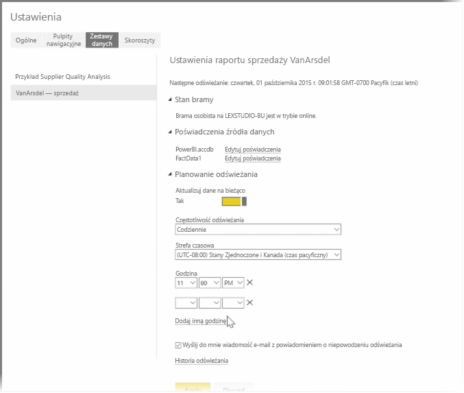

W poprzednich tematach opisaliśmy sposób łączenia ze źródłami danych za pomocą usługi Power BI oraz ręcznego odświeżania zestawów danych w usłudze Power BI. Jeśli jednak nie chcesz ręcznie odświeżać zawartości po każdej zmianie danych, możesz za pomocą usługi Power BI skonfigurować planowane odświeżanie, podczas którego nastąpi połączenie ze źródłami danych i ich automatyczne opublikowanie w usłudze Power BI. Jest to również metoda nawiązywania połączenia z dowolnymi lokalnymi źródłami danych, w tym plikami programu Excel, bazami danych programu Access, bazami danych SQL i innymi.

System, który umożliwia połączenie lokalnego źródła danych z usługą Power BI, jest nazywany **bramą danych**. Jest to mała aplikacja uruchamiana na komputerze, która używa wstępnie przygotowanego harmonogramu w celu łączenia z danymi, zbierania wszystkich aktualizacji i wypychania ich do usługi Power BI. **Brama osobista** to wersja **bramy danych**, której można używać bez żadnej konfiguracji administratora.

>[!NOTE]
>Komputer, na którym działa osobista brama usługi Power BI, *musi* być włączony i połączony z Internetem, aby **brama osobista** działała prawidłowo.
> 

Aby skonfigurować **bramę osobistą**, najpierw zaloguj się do usługi Power BI. Wybierz ikonę **Pobierz** w prawym górnym rogu ekranu, a następnie wybierz pozycję **Bramy danych** z menu.

Z tego miejsca nastąpi przeniesienie do strony internetowej, na której można wybrać pozycję **Power BI Gateway — Personal**, jak pokazano poniżej.

Uruchom aplikację, gdy jej pobieranie się zakończy, i dokończ pracę z kreatorem instalacji.

Następnie zostanie wyświetlony monit o uruchomienie kreatora konfiguracji w celu skonfigurowania bramy.

Najpierw zostanie wyświetlona prośba o zalogowanie do konta usługi Power BI, a następnie do konta systemu Windows na maszynie, ponieważ usługa bramy działa w ramach danego konta.

Wróć do usługi Power BI. Wybierz menu z wielokropkiem (trzema kropkami) obok zestawu danych do odświeżenia, a następnie wybierz pozycję **Zaplanuj odświeżanie**. Spowoduje to otwarcie strony **Ustawienia odświeżania**. Usługa Power BI wykryje zainstalowaną **bramę osobistą** i poinformuje Cię o jej stanie.

Wybierz pozycję **Edytuj poświadczenia** obok każdego odpowiedniego źródła danych i skonfiguruj uwierzytelnianie.

Na koniec ustaw opcje w obszarze **Planowanie odświeżania** w celu aktywowania aktualizacji automatycznych oraz określ, kiedy i jak często będą występować.

I to wszystko. O zaplanowanych godzinach usługa Power BI będzie komunikować się z tymi źródłami danych przy użyciu podanych poświadczeń i połączenia z komputerem z uruchomioną **bramą osobistą**, a następnie będzie aktualizować raporty i zestawy danych zgodnie z harmonogramem. Po kolejnym przejściu do usługi Power BI te pulpity nawigacyjne, raporty i zestawy danych będą odzwierciedlać dane z najnowszego zaplanowanego odświeżenia.

## Następne kroki
**Gratulacje!** Ukończono sekcję **Eksplorowanie danych** przewodnika **Nauka z przewodnikiem** dotyczącego usługi Microsoft Power BI. Usługa Power BI jest pełna interesujących sposobów eksplorowania danych, udostępniania szczegółowych informacji i korzystania z wizualizacji. Jest ona dostępna z przeglądarki — usługi, z którą możesz łączyć się z dowolnego miejsca.

Dobrze znanym, zaawansowanym partnerem usługi Power BI jest program **Excel**. Usługa Power BI i program Excel zostały zaprojektowane z myślą o wydajnym współdziałaniu; skoroszyty są u siebie w usłudze Power BI i można je w niej łatwo umieszczać.

Jak łatwo? Szczegóły poznasz w następnej sekcji: **Usługa Power BI i program Excel**.

Do zobaczenia w następnej sekcji!

