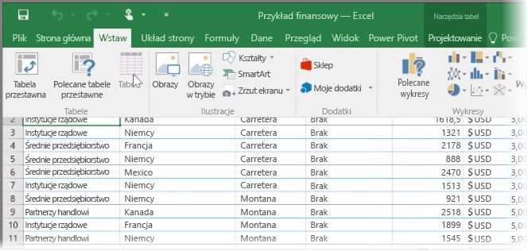
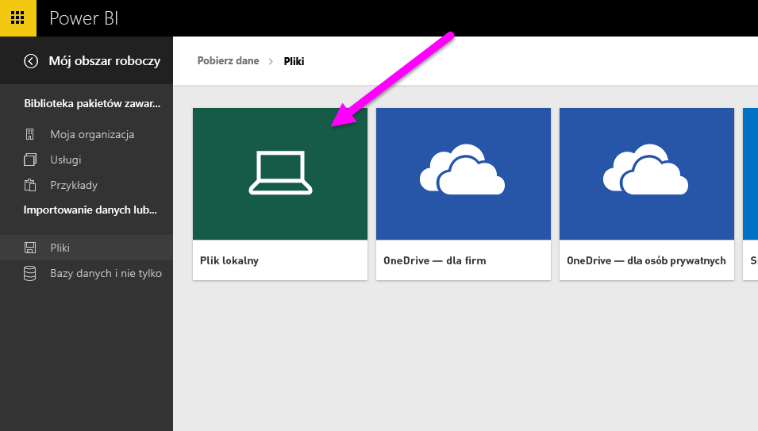
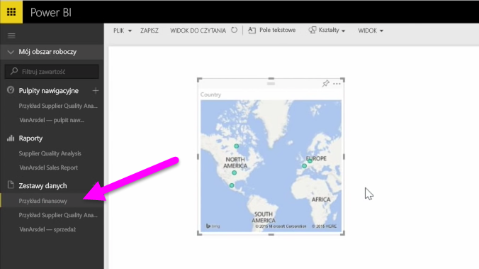

W tym temacie najpierw zobaczymy, jak zaimportować plik skoroszytu programu Excel zawierający prostą **tabelę** z dysku lokalnego do usługi Power BI. Następnie dowiesz się, jak rozpocząć eksplorowanie danych tej tabeli w usłudze Power BI, tworząc raport.

## Sprawdzanie, czy dane są sformatowane jako tabela
Aby usługa Power BI mogła zaimportować dane ze skoroszytu, muszą one być **sformatowane jako tabela**. To proste. W programie Excel możesz wyróżnić zakres komórek, a następnie na karcie **Wstawianie** na wstążce programu Excel kliknąć pozycję **Tabela**.

Warto upewnić się, że każda kolumna ma dobrą nazwę. Ułatwi to znajdowanie potrzebnych danych podczas tworzenia raportów w usłudze Power BI.

## Importowanie z dysku lokalnego
Niezależnie od tego, gdzie przechowujesz pliki, ich importowanie do usługi Power BI jest łatwe. W usłudze Power BI możesz znaleźć i wybrać potrzebny plik programu Excel, wybierając pozycję **Pobierz dane** > **Pliki** > **Plik lokalny**.

Po zaimportowaniu danych do usługi Power BI możesz przystąpić do tworzenia raportów.

Oczywiście pliki nie muszą być na dysku lokalnym. Nawet lepiej, gdy zapisujesz pliki w usłudze OneDrive lub w witrynie zespołu programu SharePoint. Bardziej szczegółowe informacje na ten temat znajdziesz w jednym z kolejnych tematów.

## Rozpoczęcie tworzenia raportów
Po zaimportowaniu danych skoroszytu usługa Power BI tworzy zestaw danych. Jest on widoczny w obszarze **Zestawy danych**. Teraz możesz rozpocząć przeglądanie danych, tworząc raporty i pulpity nawigacyjne. Wystarczy kliknąć ikonę **Otwórz menu** obok zestawu danych, a następnie kliknąć pozycję **Eksploruj**. Zostanie wyświetlona nowa, pusta kanwa raportu. Po prawej stronie w obszarze **Pola** zobaczysz tabele i kolumny. Wystarczy wybrać odpowiednie pola, aby utworzyć nową wizualizację na kanwie.

Możesz zmienić typ wizualizacji oraz zastosować **filtry** i inne właściwości w obszarze **Wizualizacje**.

