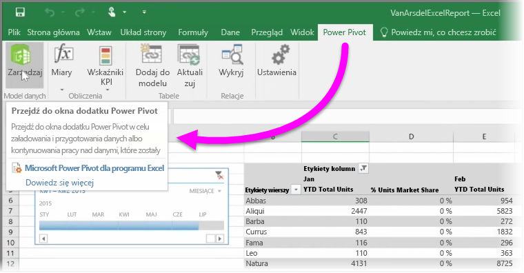

Jeśli używasz jakiejkolwiek z zaawansowanych funkcji analizy biznesowej programu Excel, na przykład **Power Query** (w programie Excel 2016 noszącej nazwę **Pobierz i przekształć**) do wykonywania zapytań i ładowania danych, **Power Pivot** do tworzenia zaawansowanych modeli danych i **Power View** do tworzenia raportów dynamicznych, możesz zaimportować je także do usługi Power BI.

Jeśli używasz funkcji **Power Pivot** do tworzenia zaawansowanych modeli danych, na przykład obejmujących wiele powiązanych tabel, miary, kolumny obliczeniowe i hierarchie, usługa Power BI zaimportuje także to wszystko.

Jeśli skoroszyt zawiera **arkusze Power View**, to żaden problem. Zostaną one utworzone ponownie jako nowe **Raporty** w usłudze Power BI. Możesz od razu rozpocząć przypinanie wizualizacji do pulpitów nawigacyjnych.

A oto jedna z najlepszych funkcji usługi Power BI: jeśli do łączenia się z zewnętrznym źródłem danych, wysyłania zapytań i ładowania danych używasz funkcji Power Query lub Power Pivot, po zaimportowaniu skoroszytu do usługi Power BI możesz skonfigurować **zaplanowane odświeżanie**. Używając zaplanowanego odświeżania, usługa Power BI korzysta z informacji o połączeniu ze skoroszytu, aby łączyć się bezpośrednio ze źródłem danych oraz wysyłać zapytania i ładować dane, które uległy zmianie. Wszystkie wizualizacje w raportach również są automatycznie aktualizowane.

