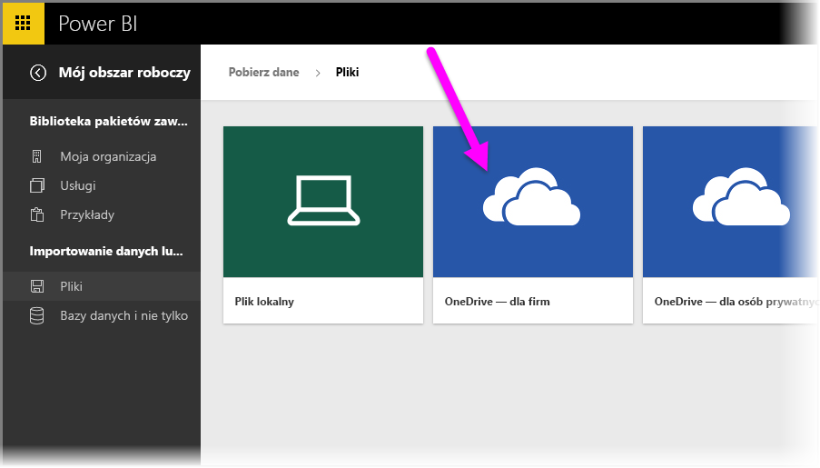
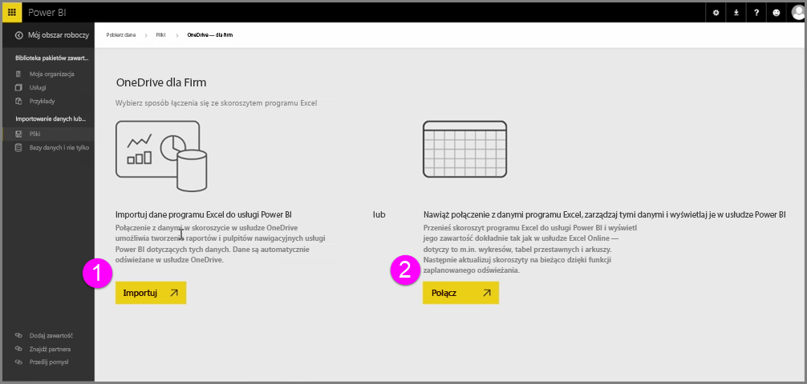
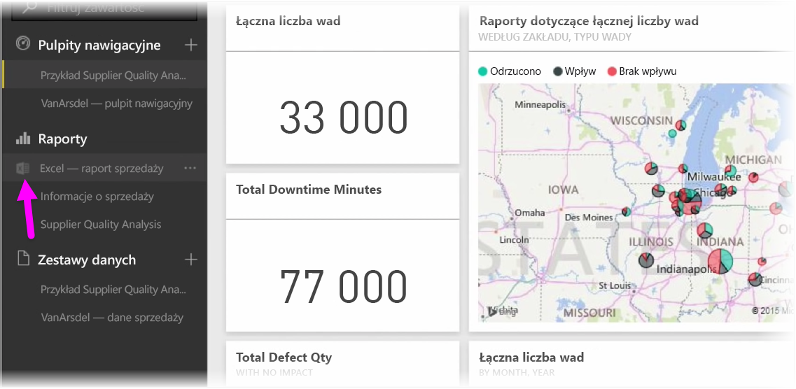
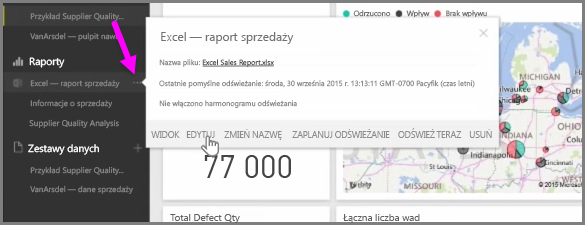

Podczas zapisywania skoroszytów programu Excel w usłudze OneDrive możesz bezproblemowo zintegrować usługę Power BI z programem Excel.

Ponieważ usługa OneDrive — podobnie jak Power BI — działa w chmurze, między tymi usługami nawiązywane jest połączenie na żywo. Zmiany wprowadzone w skoroszycie w usłudze OneDrive są *automatycznie synchronizowane* z usługą Power BI. Twoje wizualizacje w raportach i pulpity nawigacyjne są na bieżąco aktualizowane. Jeśli skoroszyt łączy się z zewnętrznymi źródłami danych, takimi jak baza danych lub źródło danych OData, korzystając z funkcji **Zaplanuj odświeżanie** usługi Power BI, możesz sprawdzić dostępność aktualizacji. Chcesz zapytać o dane w skoroszycie? Żaden problem. Możesz to zrobić, korzystając z funkcji **Pytania i odpowiedzi** usługi Power BI.

Istnieją dwa sposoby nawiązywania połączeń z plikami programu Excel w usłudze OneDrive dla Firm:

1. Importowanie danych programu Excel do usługi Power BI
2. Łączenie z programem Excel, zarządzanie nim i wyświetlanie go w usłudze Power BI

### Importowanie danych programu Excel do usługi Power BI
Jeśli decydujesz się zaimportować dane programu Excel do usługi Power BI, dane tabeli ze skoroszytu są ładowane do nowego zestawu danych w usłudze Power BI. Jeśli w skoroszycie znajdują się jakiekolwiek arkusze **Power View**, są one również importowane, a w usłudze Power BI automatycznie są tworzone nowe raporty.

Usługa Power BI utrzymuje połączenie z plikiem skoroszytu w usłudze OneDrive dla Firm. Jeśli wprowadzisz jakiekolwiek zmiany w skoroszycie, podczas zapisywania zostaną one *automatycznie zsynchronizowane** z usługą Power BI (zazwyczaj w ciągu godziny). Jeśli skoroszyt łączy się z zewnętrznymi źródłami danych, możesz skonfigurować zaplanowane odświeżanie, aby zestaw danych w usłudze Power BI był cały czas aktualny. Ponieważ wizualizacje w raportach i pulpit nawigacyjny w usłudze Power BI używają danych z zestawu danych, zapytania są przetwarzane błyskawicznie.

### Łączenie z programem Excel, zarządzanie nim i wyświetlanie go w usłudze Power BI
Jeśli wybierasz łączenie się ze skoroszytem programu Excel, praca ze skoroszytem w programie Excel i usłudze Power BI jest bezproblemowa. Gdy łączysz się w ten sposób, obok raportu skoroszytu znajduje się mała ikona programu Excel.

W raporcie skoroszyt programu Excel w usłudze Power BI jest wyświetlany tak samo jak w usłudze **Excel Online**. Arkusze w usłudze Excel Online możesz przeglądać i edytować, wybierając pozycję Edycja z menu wielokropka. Po wprowadzeniu zmian wszystkie wizualizacje przypięte do pulpitów nawigacyjnych są automatycznie aktualizowane.

W usłudze Power BI nie jest tworzony żaden zestaw danych. Wszystkie dane pozostają w skoroszycie w usłudze OneDrive. Jedną z wielu zalet tej metody jest możliwość skonfigurowania **zaplanowanego odświeżania**, gdy skoroszyt łączy się z zewnętrznymi źródłami danych. Wybrane elementy, takie jak tabele przestawne i wykresy, możesz **przypinać** bezpośrednio do pulpitów nawigacyjnych w usłudze Power BI. Wprowadzone zmiany są automatycznie odzwierciedlane w usłudze Power BI. A korzystając z doskonałych funkcji **Pytania i odpowiedzi** usługi Power BI, możesz zadawać pytania dotyczące danych w skoroszycie.  

