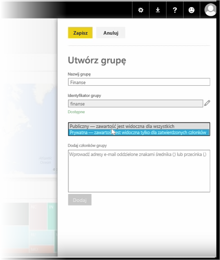
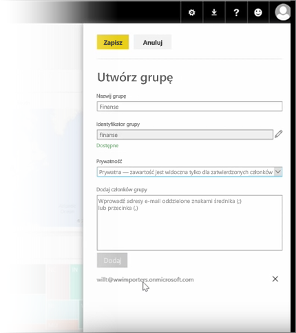

Tę lekcję zaczniemy od utworzenia *grupy*. **Grupa** definiuje zbiór użytkowników, którzy mają dostęp do określonych pulpitów nawigacyjnych, raportów i danych.

Grupy w usłudze Power BI są oparte na grupach w usłudze Office 365, dlatego jeśli używasz grup w usłudze Office 365 do zarządzania pocztą e-mail, kalendarzem i dokumentami grupy, zauważysz, że usługa Power BI zapewnia te same funkcje (a także wiele innych). Tworząc grupę w usłudze Power BI, w rzeczywistości tworzysz grupę w usłudze Office 365.

W tym module korzystamy ze scenariusza, w którym konfigurujemy nową grupę finansową. Pokażemy, jak skonfigurować grupę, udostępnić pulpity nawigacyjne, raporty i zestawy danych w grupie oraz dodać członków, którzy będą mieli dostęp do elementów w grupie.

Zaczynam tutaj, w oknie Mój obszar roboczy. Są tu pulpity nawigacyjne, raporty i zestawy danych, które zostały utworzone przeze mnie lub udostępnione dla mnie przez kogoś innego.

Jeśli rozwinę menu Mój obszar roboczy, mogę wybrać pozycję **Utwórz grupę**.

Tutaj mogę nadać jej nazwę. Korzystamy ze scenariusza z grupą finansową, dlatego nazwę ją Finanse. Usługa Power BI sprawdza, czy nazwa nie istnieje już w domenie.

Mogę ustawić poziom prywatności, decydując, czy oprócz członków grupy, ktokolwiek inny w mojej organizacji może zobaczyć jej zawartość.

Tutaj wpisuję adresy e-mail, grupy zabezpieczeń i listy dystrybucyjne. Wybieram pozycję **Dodaj**, aby utworzyć z nich członków grupy, i zapisuję grupę.

Przejdźmy do kolejnej lekcji!

